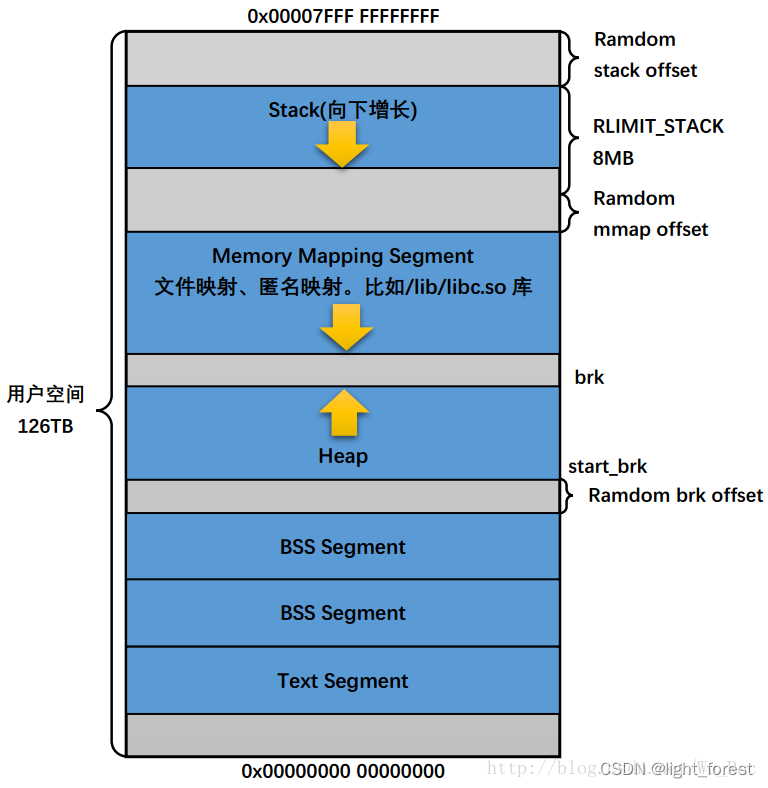
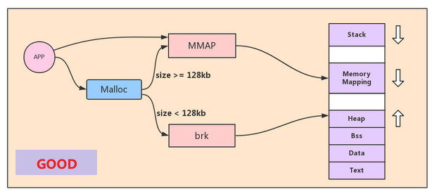

## basic

- heap 用來存動態記憶體(透過手動分配大小的記憶體)
- 會使用跟stack不同的區段

## 大小分配

- 在請求大小>=0x20000byte的時候會呼叫mmap去跟glibc要一塊新的記憶體
- 在請求大小<0x20000的時候會呼叫brk去擴展當前記憶體

## 名詞解釋

### arena

arena用於紀錄heap的狀態  
正常情況下，每個thread會有一個arena  
而main thread使用的arena就叫做main arena

### chunk

heap進行記憶體分配的基本結構  
在每次malloc的時候會切分一塊chunk給用戶使用  

### bin

free的時候會把chunk丟進bins  
目前有五個機制不同的bins

- tcache
- fast bin
- unsorted bin
- small bin
- large bin

### 