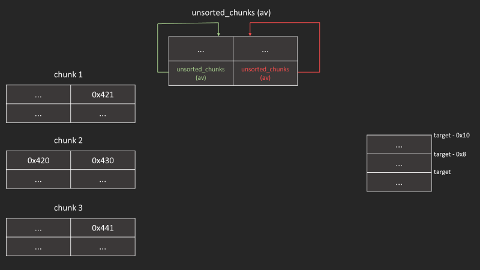
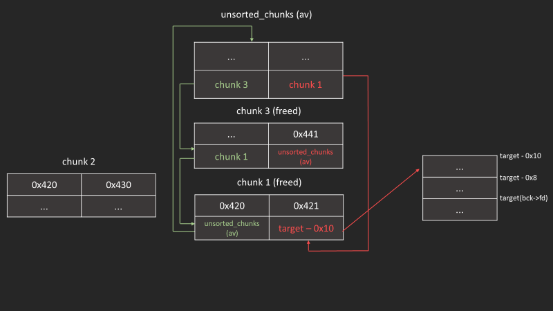

|||
|-|-|
|版本|< glibc 2.29|
|效果|可以把unsorted_chunk (av) 寫到任意位址|

## __int_malloc()

在`__int_malloc()`有這麼一段程式碼  

```c
/* remove from unsorted list */
unsorted_chunks (av)->bk = bck;
bck->fd = unsorted_chunks (av);
```

_malloc.c: 3777_  

其用途可以在unsorted_bin 遍歷過這個chunk的時候將他從double list移除
但我們如果可以控制到bck的位址，那就可以將在隨意位址寫入`unsorted_chunks (av)`的位址

## 初始化

```c
unsigned long *ptr0 = malloc(0x410);
unsigned long *ptr1 = malloc(0x420);
unsigned long *ptr2 = malloc(0x430);
```

在一開始我們可以看到unsorted_chunks(av)的fd和bk都指向自己


## free

```c
free(ptr0);
```


```c
free(ptr2);
```


free(ptr2)單純是方便觀察，如果只free(ptr0)也是可行的



## 竄改ptr0->bk

將chunk_1->bk 竄改為target-0x10

```c
ptr0[1] = (unsigned long)(&target - 0x2);
```



## malloc

malloc 跟竄改的chunksize一樣的大小


## 小發現

值得一提的是，因為unsorted bin要從尾端拿值出來，所以他會先往bk方向遍歷  
而我們chunk 1的bk已經被控制了(也就是說double linked list的結構崩壞)
所以接下來只要在malloc一次就會崩潰  

> 要注意使用到函數有調用malloc的(例如第一次呼叫printf)  
