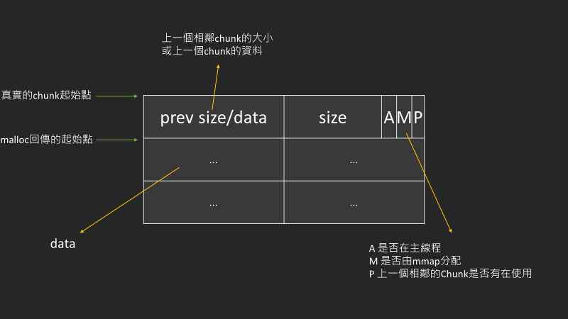
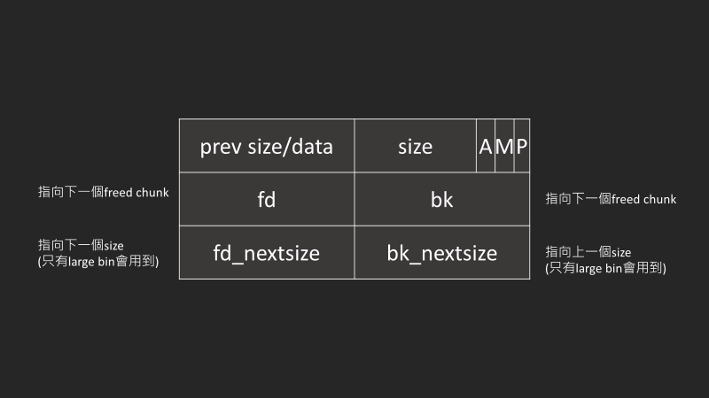

## defination

chunk的定義如下

```c
struct malloc_chunk {

  INTERNAL_SIZE_T      mchunk_prev_size;  /* Size of previous chunk (if free).  */
  INTERNAL_SIZE_T      mchunk_size;       /* Size in bytes, including overhead. */

  struct malloc_chunk* fd;         /* double links -- used only if free. */
  struct malloc_chunk* bk;

  /* Only used for large blocks: pointer to next larger size.  */
  struct malloc_chunk* fd_nextsize; /* double links -- used only if free. */
  struct malloc_chunk* bk_nextsize;
};
```

- 是malloc分配的基本記憶體單位，其size必為0x10的倍數
- 最小的chunk size是0x20

## allocated Chunk


allocated chunk代表使用中的chunk

## free chunk


被free之後的chunk會被放到對應順序、大小的bin中

## metadata

chunk的前0x10個byte會是metadata，所以使用者請求的大小會比實際的chunk大小0x10

### prev size/data

- prev size: 如果上一個chunk是freed chunk
- prev data: 如果上一個chunk是allocated chunk

這樣能使空間達到最大的利用  
而prevsize可以快速地找到上一個chunk的起始位置  

### A,M,P

因為chunk size會是0x10的倍數，所以會多出來幾個bit可以用來當別的功能使用

malloc回傳起始點