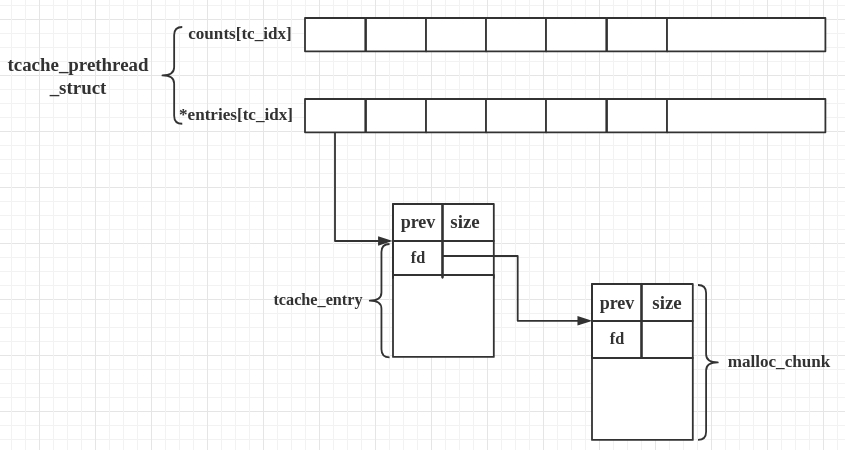
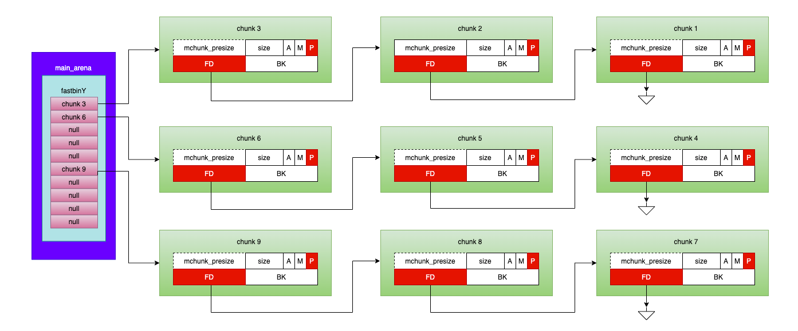
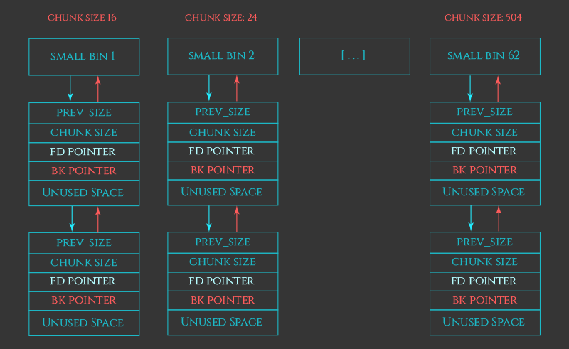
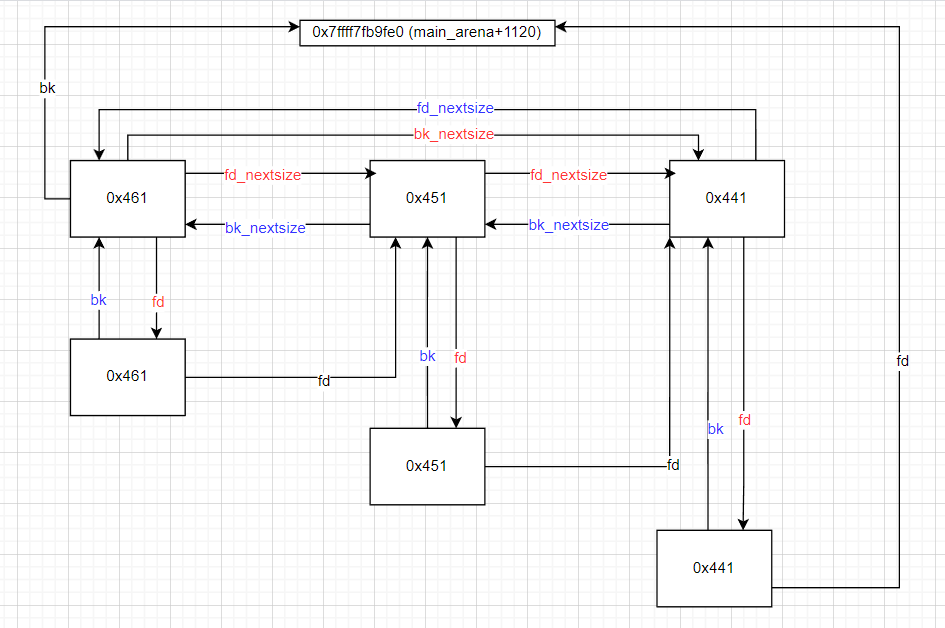

|名稱|chunk size|使用方式|查詢優先度|補充|資料結構|
|---|-----------|------|-----|---|-|
|tcache|0x20 ~ 0x410|FILO(stack)|1|被 free 後，並不會 unset 下個 chunk 的 PREV_INUSE bit|singly linked list|
|fastbin|0x20 ~ 0x80|FILO(stack)|2|被 free 後，並不會 unset 下個 chunk 的 PREV_INUSE bit|singly linked list|
|smallbin|0x20 ~ 0x3f0|FIFO(queue)|3||doubly linked list|
|largebin|>= 0x400| FIFO(queue)|5||doubly linked list|
|unsortedbin|>= 0x90| FIFO(queue)|4||doubly linked list|

## tcache

在 glibc > 2.26的版本才出現

### 保存

```c
typedef struct tcache_perthread_struct
{
  char counts[TCACHE_MAX_BINS];
  tcache_entry *entries[TCACHE_MAX_BINS];
} tcache_perthread_struct;

# define TCACHE_MAX_BINS                64

static __thread tcache_perthread_struct *tcache = NULL;
```

每個thread都會有一個`tcache_perthread_struct`，是維護tcache的管理結構

- 第一次呼叫的時候會malloc一塊記憶體存放`tcache_perthread_struct`(大小為0x290)
- `counts`:用來記錄每個鏈上面的chunk數量
- `entries`:chunk的起始點

### 運作

- tcache都會放入chunk直到被填滿(7塊)，被填滿後會把chunk放到對應大小的bins
- malloc時
  - 如果在tcache範圍內，先從tcache裡面找
  - 如果tcache為空，會從`fastbin / smallbin / unsortedbin`找size符合的
  - 找到對應size的會先將`fastbin / smallbin / unsortedbin`放到tcache內部，直到填滿
- free時
  - FILO: 會從鍊頭插入和取出chunk
- 不會進行heap consolidation，所以不unset `PREV_INUSE` bit


## fastbin

### 保存

```c
struct malloc_chunk {

  INTERNAL_SIZE_T      mchunk_prev_size;  /* Size of previous chunk (if free).  */
  INTERNAL_SIZE_T      mchunk_size;       /* Size in bytes, including overhead. */

  struct malloc_chunk* fd;         /* double links -- used only if free. */
  struct malloc_chunk* bk;

  /* Only used for large blocks: pointer to next larger size.  */
  struct malloc_chunk* fd_nextsize; /* double links -- used only if free. */
  struct malloc_chunk* bk_nextsize;
};
...
typedef struct malloc_chunk* mchunkptr;
```


```c
struct malloc_state
{
  ...

  /* Fastbins */
  mfastbinptr fastbinsY[NFASTBINS];

  ...
};
```

- fastbin各個chunk大小的pointer起始點會在被存在`main_arena`的`fastbinsY`陣列(main thread)  
- 在64位元的系統中以chunk size以0x10遞增:由0x20到0x80
- 當對應大小的tcache滿出來的時候會被存到fastbin  
- 一般情況下不會進行合併，所以不unset `PREV_INUSE` bit
- free時
  - FILO: 會從鍊頭插入和取出chunk



## smallbin

用來存放中大小的bin，會由unsortedbin轉移

### 保存 {#bins}


```c
struct malloc_state
{
  ...

  mchunkptr bins[NBINS * 2 - 2];

  ...
};
```

- `bins` 陣列負責管理`unsortedbin/smallbin/largebin`鍊的起始點  
- 大小為126 1:`unsortedbin` 2~63:`smallbin` 64~126:`largebin`

### 運作

- 進入方式
  - 由unsortedbin放入
- free時
  - FIFO: 會從鍊頭插入chunk，從鍊尾取出chunk(因為是雙向陣列，可以透過bk找到鍊尾)
  - 會進行合併: 若前方或後方的chunk為freed chunk，而合併後的chunk會被插入到unsortedbin



## largebin

### 保存

[smallbin那邊有講](#bins)，不過size不像是fastbin、smallbin是以0x10遞增的  
63條bin鍊總共分為六組，每組有相同的遞增值  
ex: 第一組由0x40做遞增，第1條bin鍊:0x400~0x430, 第2條bin鍊:0x440~0x470

|數量|遞增值|
|-|-|
|32|0x40|
|16|0x200|
|8|0x1000|
|4|0x8000|
|2|0x4000|
|1|無限制|

### 運作

- `fd_nextsize` & `bk_nextsize`
  - 在同個bin鍊會出現不同的大小，彼此用`fd_nextsize/bk_nextsize`連接(size不會照順序排)
- 進入方式
  - 由unsortedbin放入
- free時
  - FIFO: 會從鍊頭插入chunk中的對應size，從鍊尾取出chunk
  - 會進行合併



## unsortedbin

如其名，unsortedbin會串聯一堆大小不同的chunk  

### 保存

[smallbin那邊有講](#bins)

### 運作

- 以下情況會進入unsortedbin
  - fastbin size < chunk size <= tcache size, tcache該size已滿
  - 要被`合併/分割`過後的chunk
- free時
  - FIFO: 會從鍊頭插入chunk，從鍊尾取出chunk
- malloc時
  - 在查過 `tcache, smallbin`之後會去查unsortedbin是否有fit size的chunk
    - 若有則會把該chunk取出
    - 若無
      - 會把分割一塊>該chunk size的chunk(如果有)
      - 並把對應大小的chunk送到smallbin/largebin

## References

- [source code](https://elixir.bootlin.com/glibc/glibc-2.35/source/malloc/malloc.c)
- 南瓜的簡報
- https://saku376.github.io/2021/06/16/堆溢出利用之fastbin/
- https://www.eet-china.com/mp/a254008.html
- https://ctf-wiki.org/pwn/linux/user-mode/heap/ptmalloc2/implementation/tcache/
- https://blog.csdn.net/qq_41453285/article/details/96865321
- https://medium.com/@soh0ro0t/diving-deep-into-heap-glibc-fastbin-consolidation-4c1f38a70917
- https://tyeyeah.github.io/2021/05/12/2021-05-12-Heap-Exploit-Intro/