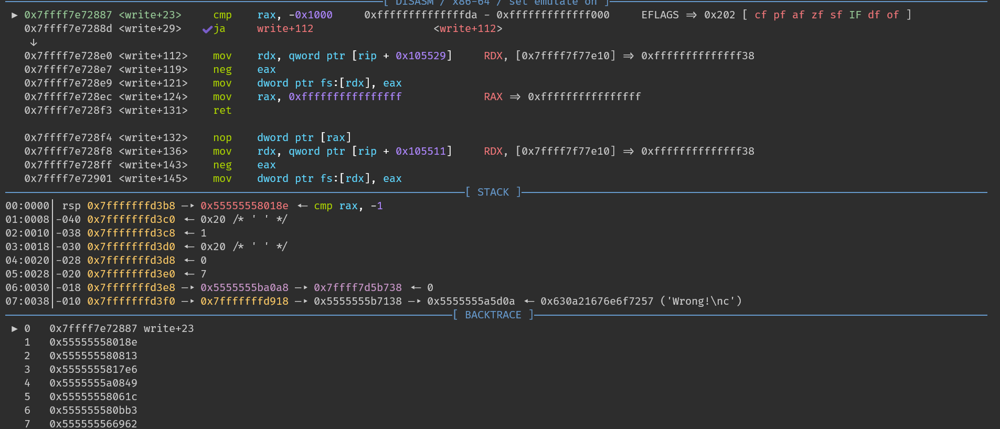
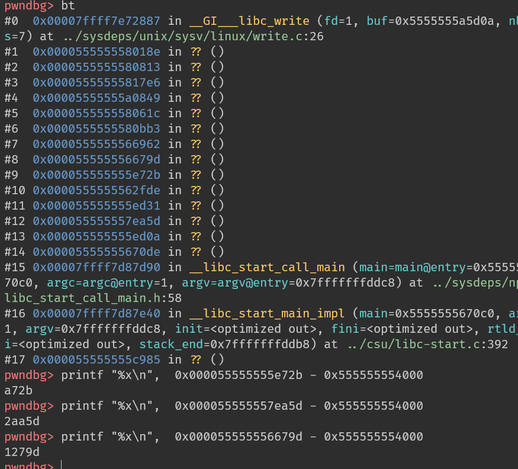
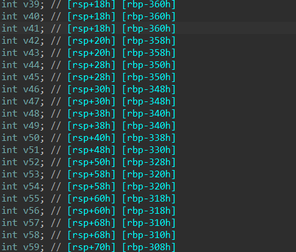
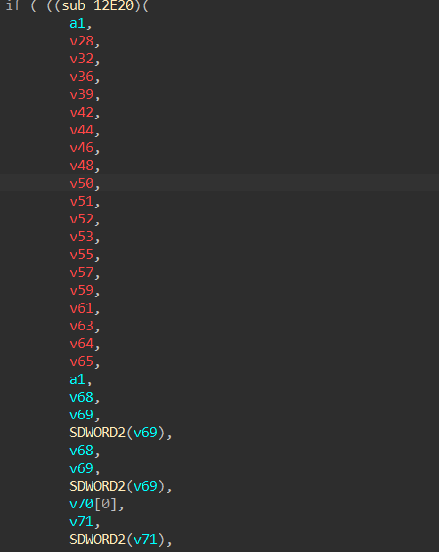
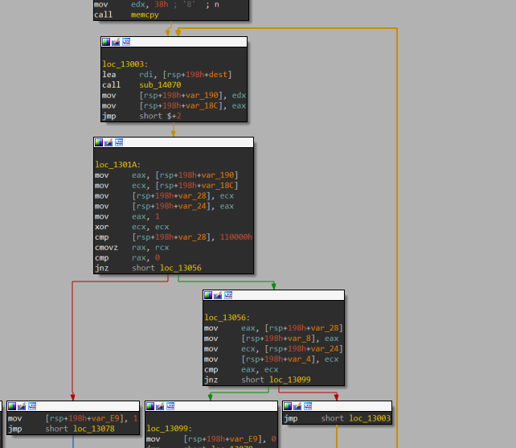
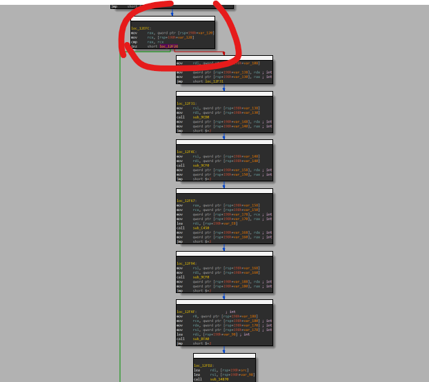
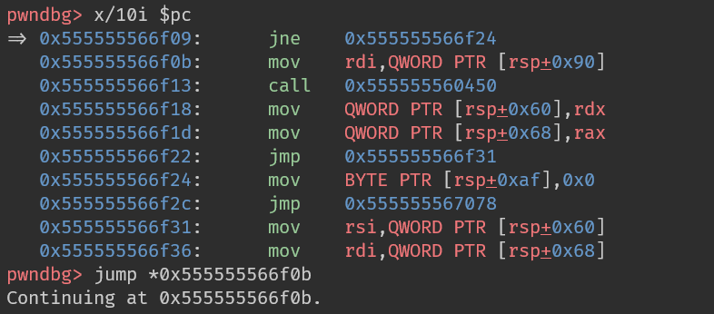
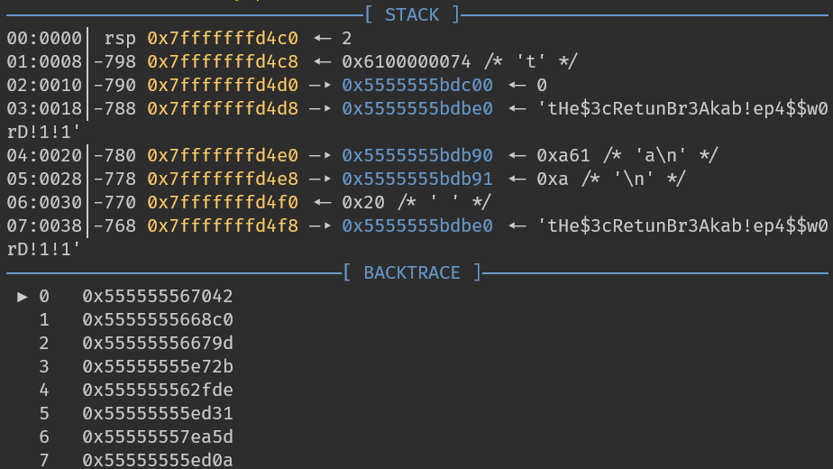

這題題目大概是輸入一串密碼，然後會驗證是否正確，若是錯誤會輸出`Wrong!`  
首先先`catch syscall write`，因為在輸出的時候大部分都會調用到`write`

觀察在輸出`Wrong!`時的函數堆疊  
我們可以假設這些函數會有其中一個會有判斷是否正確的code  

  

在`1279D`這邊我們看到有一段看起來像是call了一個判斷字串的函數  

  

跟進來，這函數有一個像是迴圈的地方，可以猜測她會逐字元判斷，在裡面下一個斷點  
  

在這個判斷式下斷點，確保繼續到跑迴圈的步驟
  
強制跳到下一個instruction(程式會繼續跑到斷點)
  
成功拿到密碼
  
