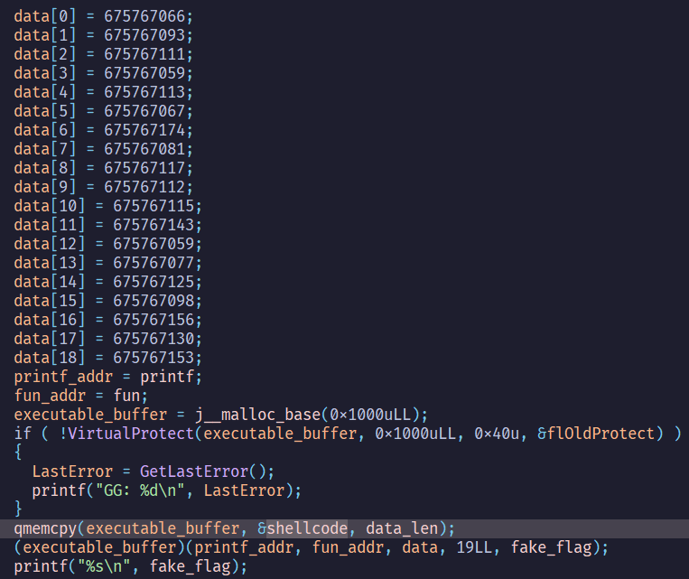
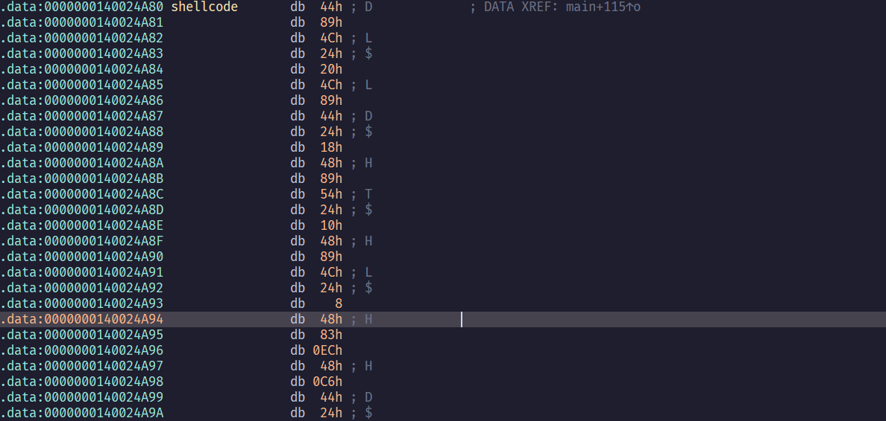
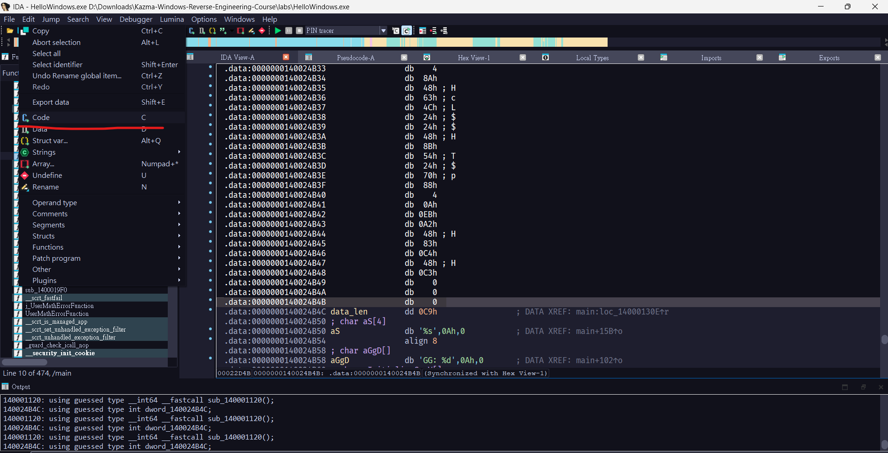
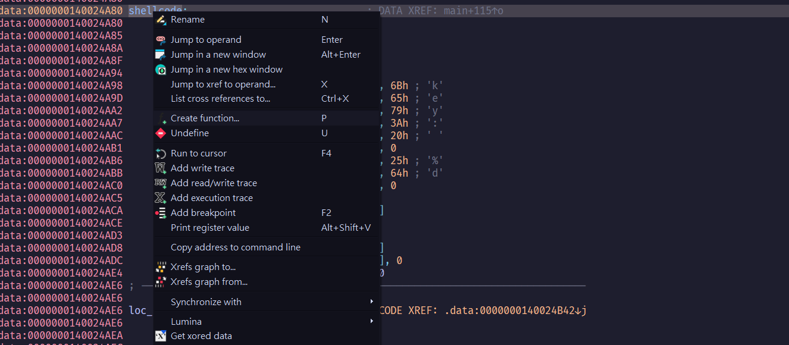
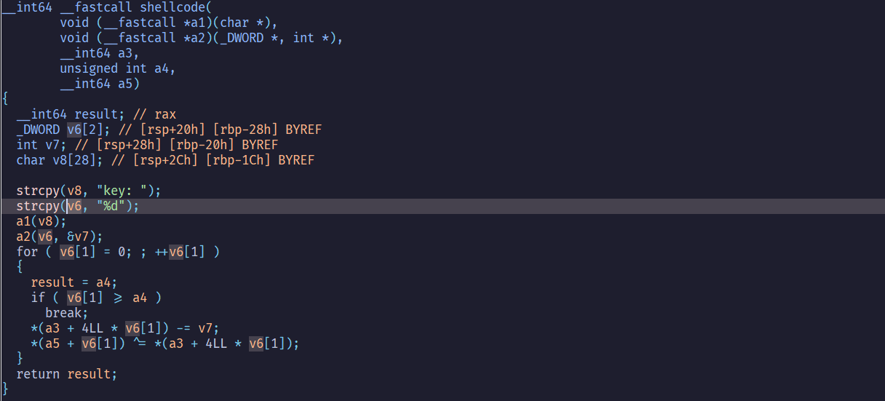
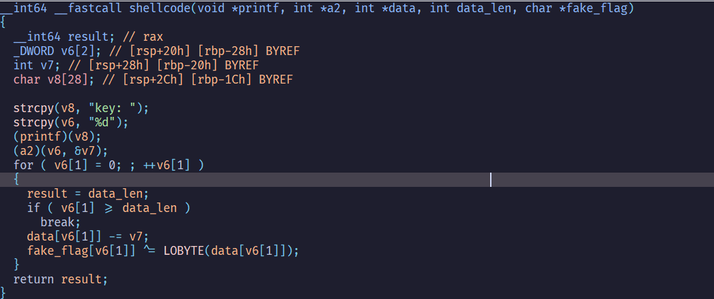

## HelloWindows.exe

### main

分析過後可以看到有使用`VirtualProtect`把一段記憶體改成`rwx`  
並把一段shellcode複製到上面，並執行他

#### shellcode_data

然後實際跳到shellcode，會看到一堆亂碼

可以使用`edit>code`把這段data轉成assembly

然後create function  

### shellcode

實際來分析shellcode

改一改參數的變數類型
`%d`被存到`v6`，且在function call的時候`v7`有使用到取址運算子`&`  
因此可以猜測`a2`是`scanf`  

接下來進入了一的for迴圈，並使用了`v6[1]`當counter  
然後對`data[v6[1]]` - `v7`，再取LOBYTE和`fake_flag`做xor

### solution

分析過程

- 使用者輸入了一個整數
- 把`data[v6[1]]` - `v7`
- 取最低byte當xor的值

因為是取最低byte，所以可以得知flag的結果只有256種，因此窮舉0~255當key就可以得到flag了