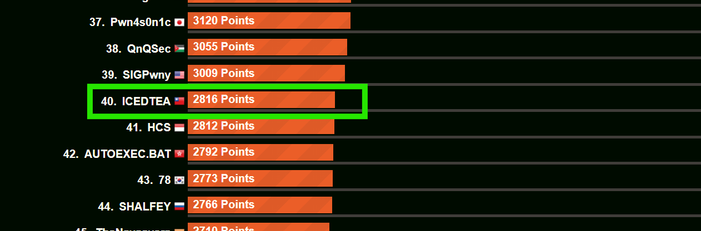
總排名`40/1529`|`TOP 2%`  

### solves (personal)

有些跟隊員有重複，但還是紀錄一下

|Category|solves|
|:--:|:--:|
|Reverse|1/6|
|Networks|1/4|
|Cryptography|1/4|
|Binary Exploitation|1/3|

## Reverse

### Crispy Kelp

這題是golang逆向，老實說我完全不懂golang，但不至於那麼難

#### main

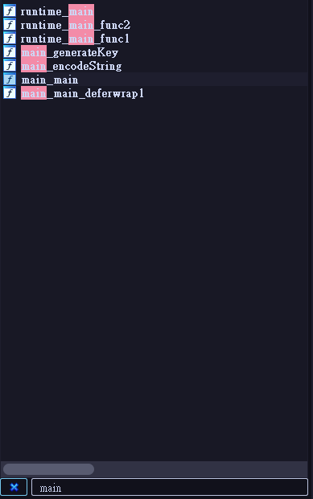
可以搜尋main，找到他

首先觀察主程式`main_main`  
可以看到`os_Stdout`、`fmt_Fprint()`  
這代表他把`v29`寫出到標準輸出，也就是輸出函數  

然後看到`os_Stdout`、`fmt_Fscanln()`  
這代表他把`v29`寫入到標準輸入，也就是輸入函數  
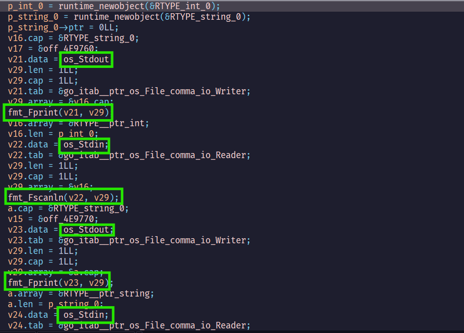  
那麼從這裡可以看到他是`輸出`->`輸入`->`輸出`->`輸入`  
可以推測他跟main函數  
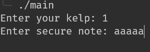

接下來進到最主要的`encodingString`  
`*p_string_0`是剛剛第二個input，`*p_int_0`是剛剛一個input


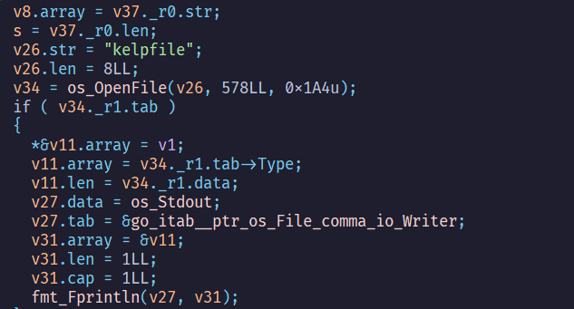

#### encodingString

  
首先會先生成金鑰  
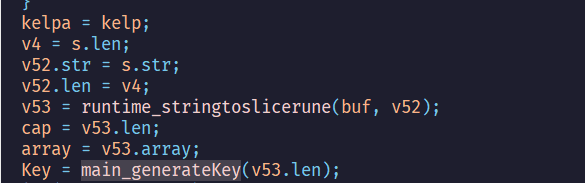

透過gdb和decompiler的交互觀察
可以發現他是一個4bytes為單位的陣列，長度會跟`s`(剛剛傳進來的字串)一樣長，然後裡面會有隨機的byte
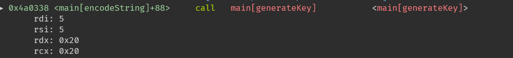
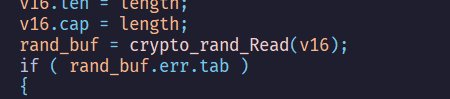
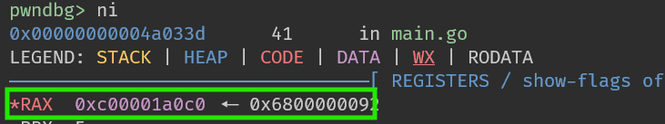
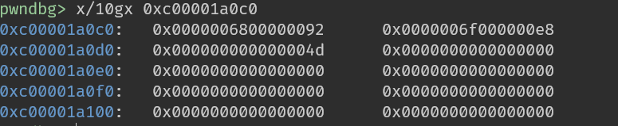

有了key之後就可以來逆加密方式了

1. s[0] ~ s[len - 1]是 `kelpa(剛剛傳入的數字) + (k[i] ^ s[i])`
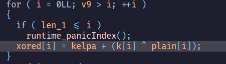
2. s[len + 1] ~ s[2*len] 是 `kelpa + (kelpa(剛剛傳入的數字) + (k[i] ^ s[i])) ^ s[i]`
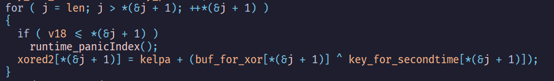  
3. s[len]是`kelpa`
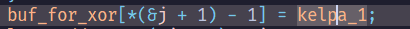  
4. 把每個字元utf8 encode
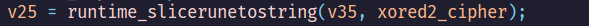
5. hex encode
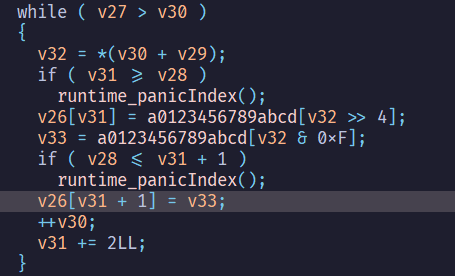

#### solve

```python
from pwn import *

buf = open('kelpfile_flag').read()
buf = bytes.fromhex(buf)
buf = buf.decode('utf-8')
buf = [ord(x) for x in buf]

slen = len(buf) // 2
xor1 = buf[:slen]
kelp = buf[slen]
xor2 = buf[slen + 1 :]


xor2 = [x - kelp for x in xor2]
key = [x ^ y for x, y in zip(xor1, xor2)]
plain = [(x - kelp) ^ y for x, y in zip(xor1, key)]
print(bytes(plain))
```