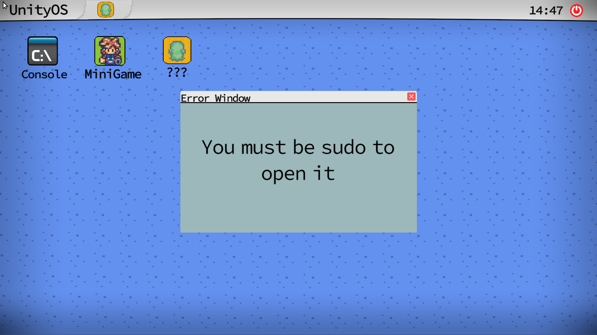
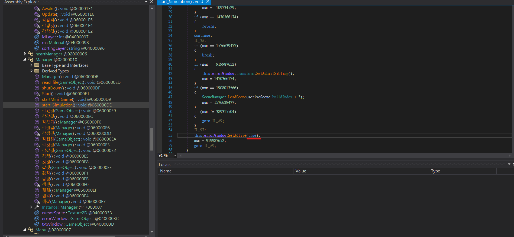
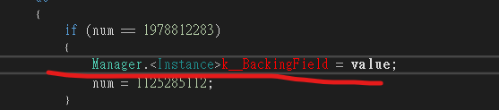
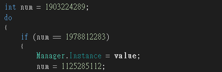
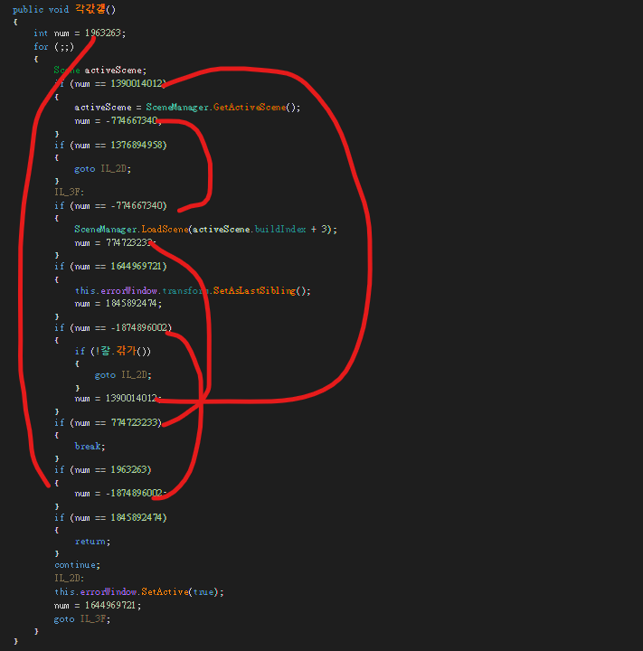
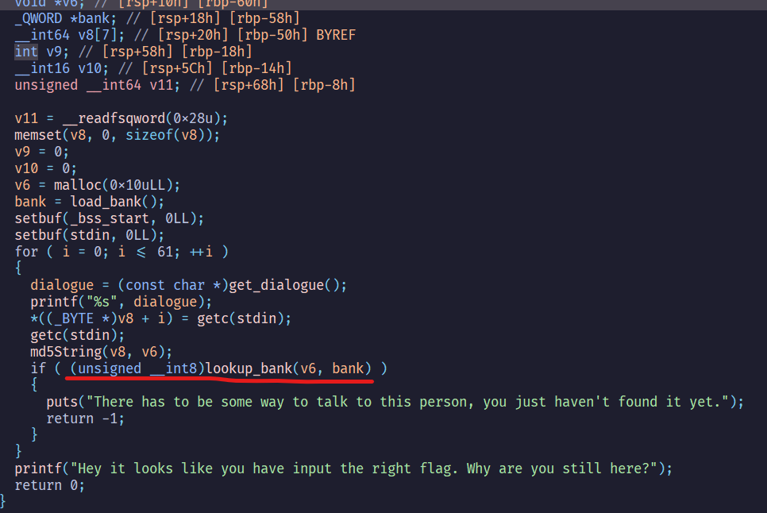
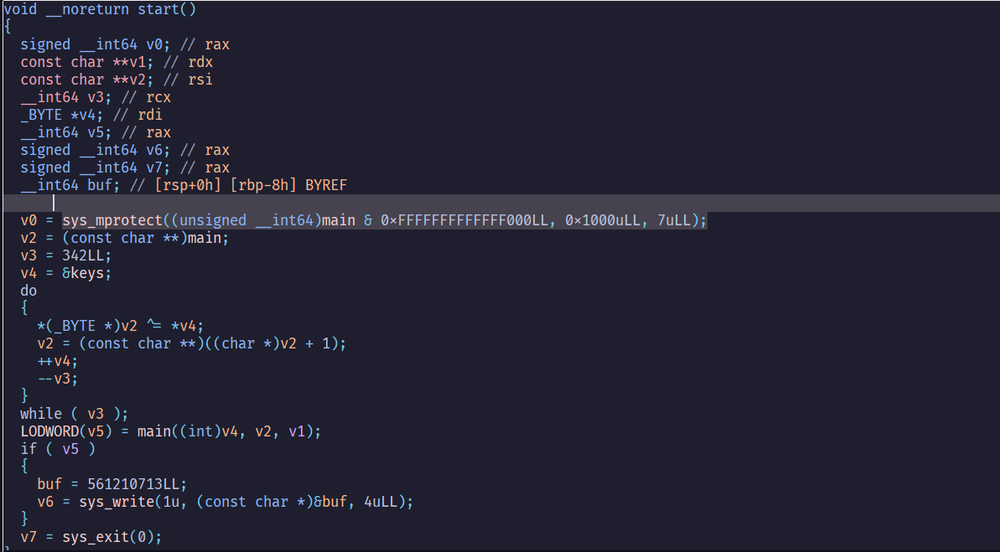
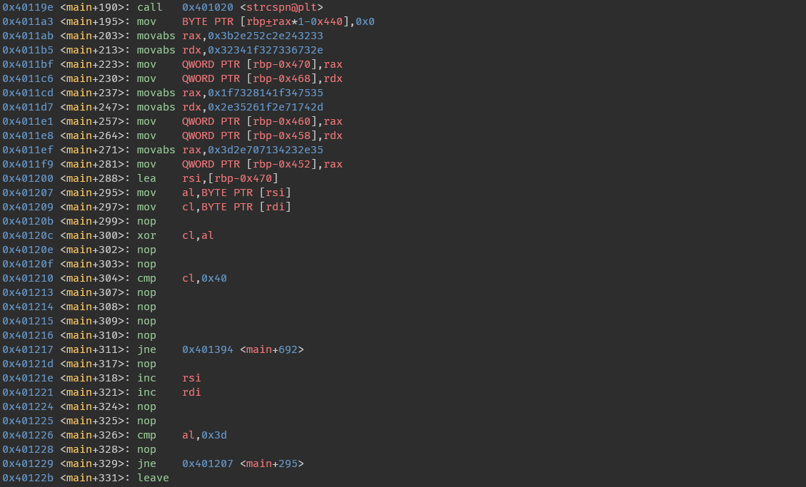
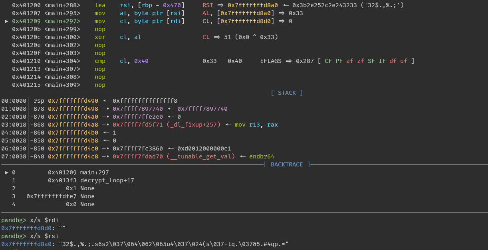

## Intro

### ranking


總排名`101/1544`|`TOP 6%`  

### solves

|Category|Solves|
|:------:|:----:|
| Misc   | 2/10 |
| Pwn    | 0/5  |
| Rev    | 3/3  |
| Web    | 1/4  |
| Crypto | 1/4  |

就...挺好玩的  
然後挺難的  

## Crypto

### Confusion

#### chal

```python
#!/usr/bin/env python3

from Crypto.Cipher import AES
from Crypto.Util.Padding import pad, unpad
import os

# Local imports
FLAG = os.getenv("FLAG", "srdnlen{REDACTED}").encode()

# Server encryption function
def encrypt(msg, key):
    pad_msg = pad(msg, 16)
    blocks = [os.urandom(16)] + [pad_msg[i:i + 16] for i in range(0, len(pad_msg), 16)]

    b = [blocks[0]]
    for i in range(len(blocks) - 1):
        tmp = AES.new(key, AES.MODE_ECB).encrypt(blocks[i + 1])
        b += [bytes(j ^ k for j, k in zip(tmp, blocks[i]))]

    c = [blocks[0]]
    for i in range(len(blocks) - 1):
        c += [AES.new(key, AES.MODE_ECB).decrypt(b[i + 1])]

    ct = [blocks[0]]
    for i in range(len(blocks) - 1):
        tmp = AES.new(key, AES.MODE_ECB).encrypt(c[i + 1])
        ct += [bytes(j ^ k for j, k in zip(tmp, c[i]))]

    return b"".join(ct)


KEY = os.urandom(32)

print("Let's try to make it confusing")
flag = encrypt(FLAG, KEY).hex()
print(f"|\n|    flag = {flag}")

while True:
    print("|\n|  ~ Want to encrypt something?")
    msg = bytes.fromhex(input("|\n|    > (hex) "))

    plaintext = pad(msg + FLAG, 16)
    ciphertext = encrypt(plaintext, KEY)

    print("|\n|  ~ Here is your encryption:")
    print(f"|\n|   {ciphertext.hex()}")
```

#### solver

$$
    b_{i+1} = Enc(P_{i+1}) \oplus P_{i} \\\
    c_{i+1} = Dec(b_{i+1}) \\\
    ct_{i+1} = Eec(c_{i+1}) \oplus c{i}  
$$

使用prepend oracle，然後這題有pad過兩次，所以可以忽略最後一個block  
需要注意的是，$P_0$是隨機數，所以$ct_2$會被影響

pf:  

$$
    c_{1} = Dec(b_{2}) \\\
    c_{1} = Dec(Enc(P_{1}) \oplus P_{0})  
$$

$$
    ct_{2} = Eec(c_{2}) \oplus  Dec(Enc(P_{1}) \oplus P_{0})
$$
所以這題我選擇跳過$ct_0$~$ct_2$

```python
from pwn import *
from tqdm import trange

r = remote("confusion.challs.srdnlen.it", 1338)

def rec(s):
    r.sendlineafter(b"> (hex) ", s.encode())
    r.recvuntil(b"|  ~ Here is your encryption:\n|\n|   ")
    return r.recvline().strip()

def get_top64byte(data):
    data = bytes.fromhex(data.decode())
    data = data[48 : 48 + 4 * 16]
    return data

flag = b""
for byte in range(53):

    base = 95 - byte
    cur_check = get_top64byte(rec("aa" * base))
    for ch in trange(0x20, 0x7f):
        payload = "aa" * (base) + flag.hex() + ch.to_bytes().hex()
        now = get_top64byte(rec(payload))
        if now == cur_check:
            flag += ch.to_bytes()
            print(flag)
            break
```

## Rev

### UnityOs

#### chal

這題是要逆一個用unity engine寫的系統(?  
Assembly-CSharp.dll有被混淆過  
要想辦法開啟這個奇怪的app  


#### solve


把這裡改成`false`

compile後可能會遇到這種error  

改成這樣就可以了

另外就是這個奇怪的順序可能導致有些變數定義失效  

順著順序去除錯了就好了  

### Sanity Check

#### chal


這個binary會去查hash過後是否在詞，如果是的話就不會是flag

#### slove

因為我第一次用一個字元查的時候發現有8個字母可以使用
，但這些字母有7個開頭的繼續查會怪怪的  

因此這題要用dfs來解  

```python
import hashlib
bank = open("hardcore.bnk", "rb").read()
bank = [bank[i:i + 16] for i in range(0, len(bank), 16)]
print(len(bank))
def md5(s):
    m = hashlib.md5()
    m.update(s)
    return m.digest()
def check(ch):
    if md5(ch.encode()) in bank:
        return True
    return False

flag = ""

def dfs(cur):
    result = []
    print(cur)
    for i in range(0x20, 0x7f):
        if not check(cur + chr(i)):
            result.append(chr(i))
    for ch in result:
        dfs(cur + ch)
    if len(result) == 0:
        print(cur)
        return

dfs(flag)
```

### It's not what it seems

#### chal

這題在start函數會把`main()`的保護關掉，然後去做xor運算，最後變成`main()`會跟原本的功能不一樣  


修改後的程式碼會檢查`cl ^ al`是否會等於`0x40`  
  

反過來說，我們只要得到所有cl的值就可以回推出al的值
而所有iteration的`cl ^ 40`組合在一起就會是flag  


#### solve

```python
from pwn import *
a = b"32$.,%.;.s6s2\037\064\062\065u4\037\024(s\037-tq.\037&5.#4qp.="
b = 0x40

print(xor(a, b.to_bytes())) 
```

## Web & Misc

打的題太水，就不寫了  
