## Intro

### ranking

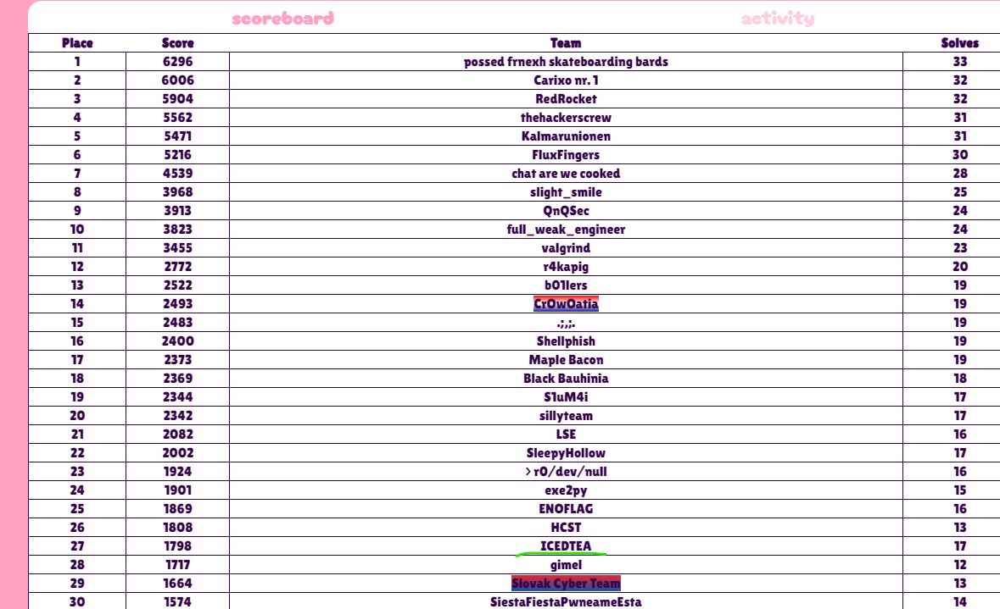
總排名`27/528`|`TOP 5%`  

這次在寒訓回來之後跑來支援，然後小打個幾題之後就跑走了:P  
下次會早點打)

### solves(personal)

|Category|Solves|
|:------:|:----:|
|  Rev   | 2/6  |

## Reverse

### pickle-season

#### chal

```python
import pickle

data = "8004637379730a6d6f64756c65730a8c017494636275696c74696e730a747970650a8c00297d87529473304e9430636275696c74696e730a7072696e740a9470320a68014e7d8c0162946802738662303063740a622e5f5f73656c665f5f0a70320a68014e7d680468027386623030284b004b004b004b004b004b004b004b004b004b004b004b004b004b004b004b004b004b004b004b004b004b004b004b004b004b004b004b004ad6ffffff6c70320a68014e7d8c0169946802738662303063740a692e657874656e640a63740a622e6d61700a63740a622e6f72640a63740a622e696e7075740a8c06466c61673f20855286528552307d4da2027d4dcc027d4dfc027d4d8f027d4dbb027d4d88027d4dfb027d4da4027d4d97027d4dfb027d4d90027d4df3027d4dc2027d4d92027d4dcd027d4da3027d4d92027d4dcd027d4da0027d4d90027d4df4027d4dc7027d4db5027d4d85027d4dc7027d4dbc027d4df1027d4da7027d4dea027d4e8c08436f72726563742173737373737373737373737373737373737373737373737373737373737370320a68014e7d8c0164946802738662303068008c05642e676574948c05692e706f70948c09782e5f5f786f725f5f94303030304ddf0270320a68014e7d8c017894680273866230306800680793680068099368006808932952855270320a68014e7d680a6802738662307d865270320a68014e7d6806680273866230306800680793680068099368006808932952855270320a68014e7d680a6802738662307d865270320a68014e7d6806680273866230306800680793680068099368006808932952855270320a68014e7d680a6802738662307d865270320a68014e7d6806680273866230306800680793680068099368006808932952855270320a68014e7d680a6802738662307d865270320a68014e7d6806680273866230306800680793680068099368006808932952855270320a68014e7d680a6802738662307d865270320a68014e7d6806680273866230306800680793680068099368006808932952855270320a68014e7d680a6802738662307d865270320a68014e7d6806680273866230306800680793680068099368006808932952855270320a68014e7d680a6802738662307d865270320a68014e7d6806680273866230306800680793680068099368006808932952855270320a68014e7d680a6802738662307d865270320a68014e7d6806680273866230306800680793680068099368006808932952855270320a68014e7d680a6802738662307d865270320a68014e7d6806680273866230306800680793680068099368006808932952855270320a68014e7d680a6802738662307d865270320a68014e7d6806680273866230306800680793680068099368006808932952855270320a68014e7d680a6802738662307d865270320a68014e7d6806680273866230306800680793680068099368006808932952855270320a68014e7d680a6802738662307d865270320a68014e7d6806680273866230306800680793680068099368006808932952855270320a68014e7d680a6802738662307d865270320a68014e7d6806680273866230306800680793680068099368006808932952855270320a68014e7d680a6802738662307d865270320a68014e7d6806680273866230306800680793680068099368006808932952855270320a68014e7d680a6802738662307d865270320a68014e7d6806680273866230306800680793680068099368006808932952855270320a68014e7d680a6802738662307d865270320a68014e7d6806680273866230306800680793680068099368006808932952855270320a68014e7d680a6802738662307d865270320a68014e7d6806680273866230306800680793680068099368006808932952855270320a68014e7d680a6802738662307d865270320a68014e7d6806680273866230306800680793680068099368006808932952855270320a68014e7d680a6802738662307d865270320a68014e7d6806680273866230306800680793680068099368006808932952855270320a68014e7d680a6802738662307d865270320a68014e7d6806680273866230306800680793680068099368006808932952855270320a68014e7d680a6802738662307d865270320a68014e7d6806680273866230306800680793680068099368006808932952855270320a68014e7d680a6802738662307d865270320a68014e7d6806680273866230306800680793680068099368006808932952855270320a68014e7d680a6802738662307d865270320a68014e7d6806680273866230306800680793680068099368006808932952855270320a68014e7d680a6802738662307d865270320a68014e7d6806680273866230306800680793680068099368006808932952855270320a68014e7d680a6802738662307d865270320a68014e7d6806680273866230306800680793680068099368006808932952855270320a68014e7d680a6802738662307d865270320a68014e7d6806680273866230306800680793680068099368006808932952855270320a68014e7d680a6802738662307d865270320a68014e7d6806680273866230306800680793680068099368006808932952855270320a68014e7d680a6802738662307d865270320a68014e7d6806680273866230306800680793680068099368006808932952855270320a68014e7d680a6802738662307d865270320a68014e7d680668027386623030680368006807934e8c0b57726f6e672e2e2e203a28865285522e"
pickle.loads(bytes.fromhex(data))
```

#### solver

> pickle 模組實作的是一個在二進位層級上對 Python 物件進行序列化（serialize）或去序列化（de-serialize）。"Pickling" 用於專門指摘將一個 Python 物件轉換為一個二進位串流的過程，"unpickling" 則相反，指的是將一個（來自 binary file 或 bytes-like object 的）二進位串流轉換回 Python 物件的過程。Pickling（和 unpickling）的過程也可能被稱作 "serialization", "marshalling," 或 "flattening"。不過，為了避免混淆，本文件將統一稱作封裝（pickling）、拆封（unpickling）。  

根據python[官方doc](https://docs.python.org/zh-tw/3/library/pickle.html)可以得知pickle可以把python物件序列化  
所以這個程式能動跟python拖不了關係，我會嘗試把他decompile為更高階的code  

使用了好用的[工具](https://github.com/trailofbits/fickling)，可以將物件load而不執行  
因此可以轉換成[python ast(抽象語法樹)](https://docs.python.org/zh-tw/3.13/library/ast.html)，再進行decompile  

```python
import astunparse
from fickling.fickle import Pickled
data = "8004637379730a6d6f64756c65730a8c017494636275696c74696e730a747970650a8c00297d87529473304e9430636275696c74696e730a7072696e740a9470320a68014e7d8c0162946802738662303063740a622e5f5f73656c665f5f0a70320a68014e7d680468027386623030284b004b004b004b004b004b004b004b004b004b004b004b004b004b004b004b004b004b004b004b004b004b004b004b004b004b004b004b004ad6ffffff6c70320a68014e7d8c0169946802738662303063740a692e657874656e640a63740a622e6d61700a63740a622e6f72640a63740a622e696e7075740a8c06466c61673f20855286528552307d4da2027d4dcc027d4dfc027d4d8f027d4dbb027d4d88027d4dfb027d4da4027d4d97027d4dfb027d4d90027d4df3027d4dc2027d4d92027d4dcd027d4da3027d4d92027d4dcd027d4da0027d4d90027d4df4027d4dc7027d4db5027d4d85027d4dc7027d4dbc027d4df1027d4da7027d4dea027d4e8c08436f72726563742173737373737373737373737373737373737373737373737373737373737370320a68014e7d8c0164946802738662303068008c05642e676574948c05692e706f70948c09782e5f5f786f725f5f94303030304ddf0270320a68014e7d8c017894680273866230306800680793680068099368006808932952855270320a68014e7d680a6802738662307d865270320a68014e7d6806680273866230306800680793680068099368006808932952855270320a68014e7d680a6802738662307d865270320a68014e7d6806680273866230306800680793680068099368006808932952855270320a68014e7d680a6802738662307d865270320a68014e7d6806680273866230306800680793680068099368006808932952855270320a68014e7d680a6802738662307d865270320a68014e7d6806680273866230306800680793680068099368006808932952855270320a68014e7d680a6802738662307d865270320a68014e7d6806680273866230306800680793680068099368006808932952855270320a68014e7d680a6802738662307d865270320a68014e7d6806680273866230306800680793680068099368006808932952855270320a68014e7d680a6802738662307d865270320a68014e7d6806680273866230306800680793680068099368006808932952855270320a68014e7d680a6802738662307d865270320a68014e7d6806680273866230306800680793680068099368006808932952855270320a68014e7d680a6802738662307d865270320a68014e7d6806680273866230306800680793680068099368006808932952855270320a68014e7d680a6802738662307d865270320a68014e7d6806680273866230306800680793680068099368006808932952855270320a68014e7d680a6802738662307d865270320a68014e7d6806680273866230306800680793680068099368006808932952855270320a68014e7d680a6802738662307d865270320a68014e7d6806680273866230306800680793680068099368006808932952855270320a68014e7d680a6802738662307d865270320a68014e7d6806680273866230306800680793680068099368006808932952855270320a68014e7d680a6802738662307d865270320a68014e7d6806680273866230306800680793680068099368006808932952855270320a68014e7d680a6802738662307d865270320a68014e7d6806680273866230306800680793680068099368006808932952855270320a68014e7d680a6802738662307d865270320a68014e7d6806680273866230306800680793680068099368006808932952855270320a68014e7d680a6802738662307d865270320a68014e7d6806680273866230306800680793680068099368006808932952855270320a68014e7d680a6802738662307d865270320a68014e7d6806680273866230306800680793680068099368006808932952855270320a68014e7d680a6802738662307d865270320a68014e7d6806680273866230306800680793680068099368006808932952855270320a68014e7d680a6802738662307d865270320a68014e7d6806680273866230306800680793680068099368006808932952855270320a68014e7d680a6802738662307d865270320a68014e7d6806680273866230306800680793680068099368006808932952855270320a68014e7d680a6802738662307d865270320a68014e7d6806680273866230306800680793680068099368006808932952855270320a68014e7d680a6802738662307d865270320a68014e7d6806680273866230306800680793680068099368006808932952855270320a68014e7d680a6802738662307d865270320a68014e7d6806680273866230306800680793680068099368006808932952855270320a68014e7d680a6802738662307d865270320a68014e7d6806680273866230306800680793680068099368006808932952855270320a68014e7d680a6802738662307d865270320a68014e7d6806680273866230306800680793680068099368006808932952855270320a68014e7d680a6802738662307d865270320a68014e7d6806680273866230306800680793680068099368006808932952855270320a68014e7d680a6802738662307d865270320a68014e7d6806680273866230306800680793680068099368006808932952855270320a68014e7d680a6802738662307d865270320a68014e7d680668027386623030680368006807934e8c0b57726f6e672e2e2e203a28865285522e"
pkl = Pickled.load(bytes.fromhex(data))
print(astunparse.unparse(pkl.ast))
```

執行結果

```python
from sys import modules
_var0 = type('', (), {})
_var1 = modules
_var1['t'] = _var0
_var2 = _var0
_var2.__setstate__((None, {'b': print}))
from t import b.__self__
_var3 = _var0
_var3.__setstate__((None, {'b': b.__self__}))
_var4 = _var0
_var4.__setstate__((None, {'i': [0, 0, 0, 0, 0, 0, 0, 0, 0, 0, 0, 0, 0, 0, 0, 0, 0, 0, 0, 0, 0, 0, 0, 0, 0, 0, 0, 0, -42]}))
from t import i.extend
from t import b.map
from t import b.ord
from t import b.input
_var5 = b.input('Flag? ')
_var6 = b.map(b.ord, _var5)
_var7 = i.extend(_var6)
_var8 = _var0
_var8.__setstate__((None, {'d': {674: {716: {764: {655: {699: {648: {763: {676: {663: {763: {656: {755: {706: {658: {717: {675: {658: {717: {672: {656: {756: {711: {693: {645: {711: {700: {753: {679: {746: {None: 'Correct!'}}}}}}}}}}}}}}}}}}}}}}}}}}}}}}}))
_var9 = _var0
_var9.__setstate__((None, {'x': 735}))
from t import d.get
from t import x.__xor__
from t import i.pop
_var10 = i.pop()
_var11 = x.__xor__(_var10)
_var12 = _var0
_var12.__setstate__((None, {'x': _var11}))
_var13 = d.get(_var11, {})
_var14 = _var0
_var14.__setstate__((None, {'d': _var13}))
from t import d.get
from t import x.__xor__
from t import i.pop
_var15 = i.pop()
_var16 = x.__xor__(_var15)
_var17 = _var0
_var17.__setstate__((None, {'x': _var16}))
_var18 = d.get(_var16, {})
_var19 = _var0
_var19.__setstate__((None, {'d': _var18}))
from t import d.get
from t import x.__xor__
from t import i.pop
_var20 = i.pop()
_var21 = x.__xor__(_var20)
_var22 = _var0
_var22.__setstate__((None, {'x': _var21}))
_var23 = d.get(_var21, {})
_var24 = _var0
_var24.__setstate__((None, {'d': _var23}))
from t import d.get
from t import x.__xor__
from t import i.pop
_var25 = i.pop()
_var26 = x.__xor__(_var25)
_var27 = _var0
_var27.__setstate__((None, {'x': _var26}))
_var28 = d.get(_var26, {})
_var29 = _var0
_var29.__setstate__((None, {'d': _var28}))
from t import d.get
from t import x.__xor__
from t import i.pop
_var30 = i.pop()
_var31 = x.__xor__(_var30)
_var32 = _var0
_var32.__setstate__((None, {'x': _var31}))
_var33 = d.get(_var31, {})
_var34 = _var0
_var34.__setstate__((None, {'d': _var33}))
from t import d.get
from t import x.__xor__
from t import i.pop
_var35 = i.pop()
_var36 = x.__xor__(_var35)
_var37 = _var0
_var37.__setstate__((None, {'x': _var36}))
_var38 = d.get(_var36, {})
_var39 = _var0
_var39.__setstate__((None, {'d': _var38}))
from t import d.get
from t import x.__xor__
from t import i.pop
_var40 = i.pop()
_var41 = x.__xor__(_var40)
_var42 = _var0
_var42.__setstate__((None, {'x': _var41}))
_var43 = d.get(_var41, {})
_var44 = _var0
_var44.__setstate__((None, {'d': _var43}))
from t import d.get
from t import x.__xor__
from t import i.pop
_var45 = i.pop()
_var46 = x.__xor__(_var45)
_var47 = _var0
_var47.__setstate__((None, {'x': _var46}))
_var48 = d.get(_var46, {})
_var49 = _var0
_var49.__setstate__((None, {'d': _var48}))
from t import d.get
from t import x.__xor__
from t import i.pop
_var50 = i.pop()
_var51 = x.__xor__(_var50)
_var52 = _var0
_var52.__setstate__((None, {'x': _var51}))
_var53 = d.get(_var51, {})
_var54 = _var0
_var54.__setstate__((None, {'d': _var53}))
from t import d.get
from t import x.__xor__
from t import i.pop
_var55 = i.pop()
_var56 = x.__xor__(_var55)
_var57 = _var0
_var57.__setstate__((None, {'x': _var56}))
_var58 = d.get(_var56, {})
_var59 = _var0
_var59.__setstate__((None, {'d': _var58}))
from t import d.get
from t import x.__xor__
from t import i.pop
_var60 = i.pop()
_var61 = x.__xor__(_var60)
_var62 = _var0
_var62.__setstate__((None, {'x': _var61}))
_var63 = d.get(_var61, {})
_var64 = _var0
_var64.__setstate__((None, {'d': _var63}))
from t import d.get
from t import x.__xor__
from t import i.pop
_var65 = i.pop()
_var66 = x.__xor__(_var65)
_var67 = _var0
_var67.__setstate__((None, {'x': _var66}))
_var68 = d.get(_var66, {})
_var69 = _var0
_var69.__setstate__((None, {'d': _var68}))
from t import d.get
from t import x.__xor__
from t import i.pop
_var70 = i.pop()
_var71 = x.__xor__(_var70)
_var72 = _var0
_var72.__setstate__((None, {'x': _var71}))
_var73 = d.get(_var71, {})
_var74 = _var0
_var74.__setstate__((None, {'d': _var73}))
from t import d.get
from t import x.__xor__
from t import i.pop
_var75 = i.pop()
_var76 = x.__xor__(_var75)
_var77 = _var0
_var77.__setstate__((None, {'x': _var76}))
_var78 = d.get(_var76, {})
_var79 = _var0
_var79.__setstate__((None, {'d': _var78}))
from t import d.get
from t import x.__xor__
from t import i.pop
_var80 = i.pop()
_var81 = x.__xor__(_var80)
_var82 = _var0
_var82.__setstate__((None, {'x': _var81}))
_var83 = d.get(_var81, {})
_var84 = _var0
_var84.__setstate__((None, {'d': _var83}))
from t import d.get
from t import x.__xor__
from t import i.pop
_var85 = i.pop()
_var86 = x.__xor__(_var85)
_var87 = _var0
_var87.__setstate__((None, {'x': _var86}))
_var88 = d.get(_var86, {})
_var89 = _var0
_var89.__setstate__((None, {'d': _var88}))
from t import d.get
from t import x.__xor__
from t import i.pop
_var90 = i.pop()
_var91 = x.__xor__(_var90)
_var92 = _var0
_var92.__setstate__((None, {'x': _var91}))
_var93 = d.get(_var91, {})
_var94 = _var0
_var94.__setstate__((None, {'d': _var93}))
from t import d.get
from t import x.__xor__
from t import i.pop
_var95 = i.pop()
_var96 = x.__xor__(_var95)
_var97 = _var0
_var97.__setstate__((None, {'x': _var96}))
_var98 = d.get(_var96, {})
_var99 = _var0
_var99.__setstate__((None, {'d': _var98}))
from t import d.get
from t import x.__xor__
from t import i.pop
_var100 = i.pop()
_var101 = x.__xor__(_var100)
_var102 = _var0
_var102.__setstate__((None, {'x': _var101}))
_var103 = d.get(_var101, {})
_var104 = _var0
_var104.__setstate__((None, {'d': _var103}))
from t import d.get
from t import x.__xor__
from t import i.pop
_var105 = i.pop()
_var106 = x.__xor__(_var105)
_var107 = _var0
_var107.__setstate__((None, {'x': _var106}))
_var108 = d.get(_var106, {})
_var109 = _var0
_var109.__setstate__((None, {'d': _var108}))
from t import d.get
from t import x.__xor__
from t import i.pop
_var110 = i.pop()
_var111 = x.__xor__(_var110)
_var112 = _var0
_var112.__setstate__((None, {'x': _var111}))
_var113 = d.get(_var111, {})
_var114 = _var0
_var114.__setstate__((None, {'d': _var113}))
from t import d.get
from t import x.__xor__
from t import i.pop
_var115 = i.pop()
_var116 = x.__xor__(_var115)
_var117 = _var0
_var117.__setstate__((None, {'x': _var116}))
_var118 = d.get(_var116, {})
_var119 = _var0
_var119.__setstate__((None, {'d': _var118}))
from t import d.get
from t import x.__xor__
from t import i.pop
_var120 = i.pop()
_var121 = x.__xor__(_var120)
_var122 = _var0
_var122.__setstate__((None, {'x': _var121}))
_var123 = d.get(_var121, {})
_var124 = _var0
_var124.__setstate__((None, {'d': _var123}))
from t import d.get
from t import x.__xor__
from t import i.pop
_var125 = i.pop()
_var126 = x.__xor__(_var125)
_var127 = _var0
_var127.__setstate__((None, {'x': _var126}))
_var128 = d.get(_var126, {})
_var129 = _var0
_var129.__setstate__((None, {'d': _var128}))
from t import d.get
from t import x.__xor__
from t import i.pop
_var130 = i.pop()
_var131 = x.__xor__(_var130)
_var132 = _var0
_var132.__setstate__((None, {'x': _var131}))
_var133 = d.get(_var131, {})
_var134 = _var0
_var134.__setstate__((None, {'d': _var133}))
from t import d.get
from t import x.__xor__
from t import i.pop
_var135 = i.pop()
_var136 = x.__xor__(_var135)
_var137 = _var0
_var137.__setstate__((None, {'x': _var136}))
_var138 = d.get(_var136, {})
_var139 = _var0
_var139.__setstate__((None, {'d': _var138}))
from t import d.get
from t import x.__xor__
from t import i.pop
_var140 = i.pop()
_var141 = x.__xor__(_var140)
_var142 = _var0
_var142.__setstate__((None, {'x': _var141}))
_var143 = d.get(_var141, {})
_var144 = _var0
_var144.__setstate__((None, {'d': _var143}))
from t import d.get
from t import x.__xor__
from t import i.pop
_var145 = i.pop()
_var146 = x.__xor__(_var145)
_var147 = _var0
_var147.__setstate__((None, {'x': _var146}))
_var148 = d.get(_var146, {})
_var149 = _var0
_var149.__setstate__((None, {'d': _var148}))
from t import d.get
from t import x.__xor__
from t import i.pop
_var150 = i.pop()
_var151 = x.__xor__(_var150)
_var152 = _var0
_var152.__setstate__((None, {'x': _var151}))
_var153 = d.get(_var151, {})
_var154 = _var0
_var154.__setstate__((None, {'d': _var153}))
from t import d.get
_var155 = d.get(None, 'Wrong... :(')
_var156 = print(_var155)
result = _var156
```

雖然我看不了解他的語法，但可以去猜測
x每次會被xor一個值
且在每次更新完之後會更新'x'的值為被xor過後的值

```python
check = [735,674,716,764,655,699,648,763,676,663,763,656,755,706,658,717,675,658,717,672,656,756,711,693,645,711,700,753,679,746]

flag = ""
for i in range(len(check) - 1):
    flag += chr(check[i] ^ check[i + 1])

print(flag[::-1])
```

### net-msg

#### chal

題目給你一個binary，要連線和遠端互動
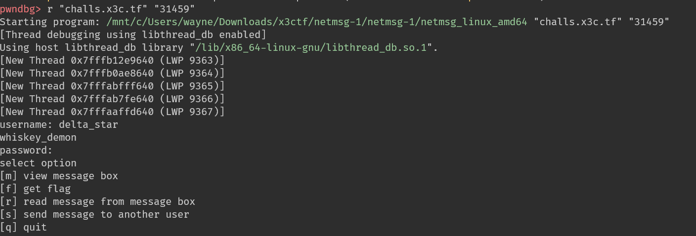

#### solve

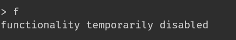
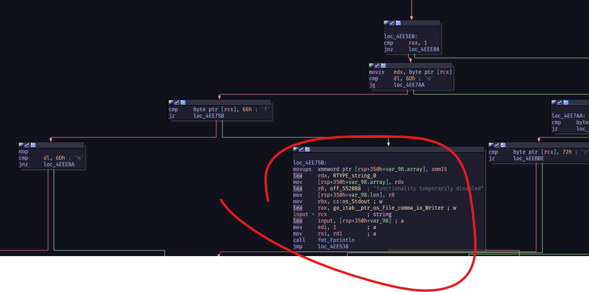

可以看到binary是沒有實作`f`的功能，同樣包括其他所有功能，推測是後端在執行  

接著看`m`實作
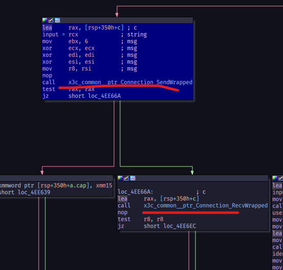
有`Send`和`Recv`，且功能正常

`send`並未傳出任何信息，這有點詭異，然後有很多功能有調用到`SendWrapped`，因此我推測另外有一個值在控制他要選擇的功能
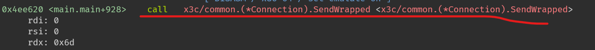
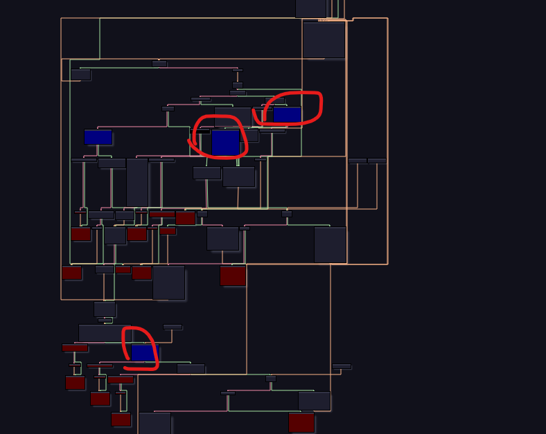

進去`SendWrapped`下斷點，發現`bl`的值在每個不同的功能都不一樣
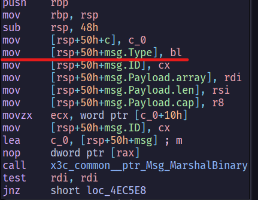  
下斷點在function call之前，改剛剛`bl`的值
然後經過我的嘗試，改成8的報錯會不一樣  
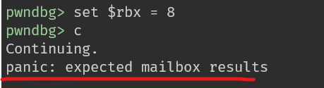
代表他有接收到值，但不是mailbox的結果  
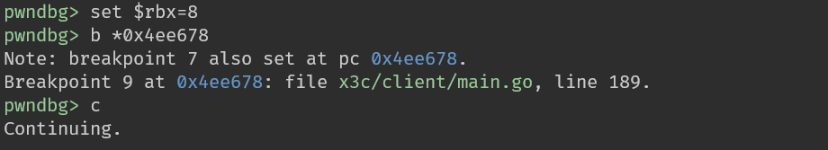
在call `RecvWrapped`後下斷點，因為後面有一個處理結果的實作  
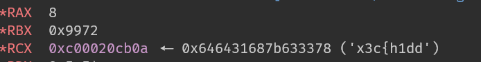
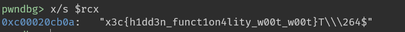
順利解決
